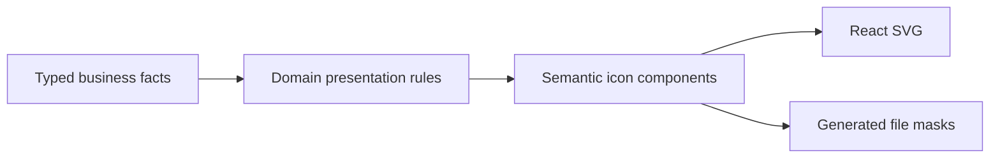

# Icon Semantics

## Goal

Make each product glyph follow the actual object, action, or state it presents.
Business data carries meaning; renderer presentation rules select semantic icon
components; those components use Iconoir. Ship the complete contract, consumers,
and library replacement as **one complete feature in one PR**.

## Non-goals

- No action execution, admission, tool protocol, persistence, or security-policy
  changes. Object/action presentation contracts are explicitly in scope.
- No theme, status-color, hit-target, or layout redesign.
- No compatibility aliases for ambiguous meanings, configurable icon registry,
  global icon-name enum, global provider, or runtime catalog loading.
- No replacement of user-authored emoji, provider/app logos, speaker identity
  artwork, native OS controls, keyboard notation, or structural outline bullets.
- No restoration or visual redesign of Subagent surfaces retired by delegation.

## Design

### Responsibility Boundaries



| Owner | Responsibility | Examples |
| --- | --- | --- |
| Core/main | Describe the object and intended action, independent of graphics. | Today system key, tagDef node type, desired pinned state, file source kind. |
| Renderer domain presentation | Select directly from those facts. Reused by every surface presenting that meaning. | Action selection, object identity, file kind, tool operation. |
| Renderer icon components | Bind semantic names to Iconoir and own visual specifications. | OpenInBrowserIcon, OpenInDefaultAppIcon, NumberFieldIcon, HighlightIcon. |
| Surface/control | Place the result and expose labels, interaction, and state. | Menu sizing, tooltip, focus, disabled state, status announcement. |

There is one selection path per meaning. Remove `IconId`, its producer tables,
and the renderer's base-map-plus-override pattern. Do not replace it with another
universal string catalog. A fixed Search button imports `SearchIcon` directly;
only genuinely data-dependent choices need a domain resolver.

### Business Presentation Contracts

`ActionPresentation` already carries the discriminated `actionId` and typed
`binding`. Remove its `iconId` field and all icon arguments/tables from the action
registry. Keep desired-state arguments, admission, evaluation, names, and
execution unchanged. A rejected action retains its action meaning; rejection
is status, not a different action glyph.

Replace `ObjectPresentation.iconId` with the minimum missing business facts,
using a discriminated union. Keep common labels, opaque `objectRef`, optional
user emoji, and `backingNodeId`. The proposed variant fields are:

```ts
type ObjectPresentationKind =
  | {
      kind: 'node';
      node:
        | { kind: 'system'; key: SystemNodeKey }
        | { kind: 'document'; nodeType: NodeProjection['type'] | null };
    }
  | { kind: 'nodeSelection' }
  | { kind: 'draft'; purpose: 'node' | 'tag' }
  | { kind: 'appSurface'; surface: AppSurface }
  | { kind: 'externalPage'; sourceKind: 'web' | 'application' | 'unknown' };
```

These fields belong to the corresponding `ObjectPresentation` variant, not a
second `meaning` field alongside equivalent facts. `presentObject` projects
system keys and node types from the existing object facets/projection, and
copies draft purpose and app surface from the source object. A missing document
has `nodeType: null`; it does not invent a type. Tag parameter candidates use the
same producer and the real `tagDef` type. An ordinary node carrying tags is not
itself a tag definition. Candidate-specific names can still be supplied without
recreating the object variant in the service.

The external-context host supplies `sourceKind` through `ExternalPageDescription`:
`web` requires an actual HTTP(S) URL in the captured browser/source evidence,
`application` identifies available application context, and missing context is
`unknown`. A browser name alone does not prove a web page. This describes the
existing captured object; it does not request new capture permissions or expose
its full context to the renderer. Keep execution routing and `SurfaceObject`
identity unchanged.

Today therefore arrives as a system node whose key is `today`. Changing its
graphic later touches only the renderer. No producer sends `calendar`, a vendor
name, or a graphic choice; no renderer parses labels or opaque refs for meaning.

### Domain Presentation Rules

| Domain | Single rule and consumers |
| --- | --- |
| Actions | `iconForAction(ActionPresentation)` selects directly from actionId and typed arguments. Context menus and any icon-bearing action presentation reuse it. |
| Objects | A shared `ObjectGlyph` resolves user emoji, structural bullet, or semantic component once. Launcher rows/chips and menu parameter candidates reuse it. |
| Preview opening | One preview action builder derives label and semantic component from the same URL/file target used by its run callback. Panel, body, pill, and menu receive this resolved action. |
| Fields and views | Field-type presentation owns type icons. A shared view-mode rule serves both the current-mode indicator and setViewMode actions. |
| Tools | One local tool-presentation resolver returns operation meaning and component. Rows and groups consume the same result. |
| Files | One exhaustive file-kind table serves React presentations and CSS-mask generation. |

Action rules distinguish open/split/capture/create, pin/unpin, done/not-done,
move direction/destination, view mode, toolbar visibility, and view sections.
The registry's `open` navigates inside Tenon; external opening belongs to the
preview/field target rule. When `binding.state` is `needsParameter`, select from
the action family and available seed; never cast a seed to complete arguments
or guess a boolean/direction. Known action variants are checked exhaustively.
The action panel stays text-only. Its lack of glyphs is not a coverage defect.

Object resolution follows one explicit precedence: user emoji when supplied;
then system identity, document type, draft purpose, app surface, or external
source kind. Ordinary document nodes use the structural bullet; tag definitions
use the tag component; selections use the outline component. Drafts use the
creation marker with their node/tag label. Existing external context never uses
the creation marker: known web pages use the web-object component, application
or unknown context uses the application-context component. Shared rendering
keeps slots stable. Tag color remains identity-derived where available; the
neutral inherited color is the fallback. No surface reclassifies candidates
from the parameter slot, translated name, or previous icon.

Tool operation meaning is local to tool presentation and exists because groups
need to compare operations. Resolve write/overwrite, explicit create/edit/delete,
path/content search, search/fetch, MCP, and surviving collaboration verbs from
their actual data. Distinct operations may share a component; component identity
and broad activity-summary buckets cannot determine group homogeneity. Empty or
mixed groups use the generic tool component. Unknown tools retain their label
and a generic glyph. Execution status remains independently visible.

Unexpected inspection-only presentation data records a diagnostic and leaves a
neutral/empty glyph slot with the available label. It must not throw on the user
path or silently turn an unknown object into a web page.

### Icon Components And Visual Rules

`src/renderer/ui/icons.ts` is the only public source of functional icon
components and the only vendor import boundary. Export semantic names for
distinct meanings even when their drawings match. Remove ambiguous aliases such
as `OpenIcon` and `HashIcon`; use browser/default-app/navigation and number/tag
names. Shared conventions such as Search and Close need no alias per screen.

Define vendor-independent `AppIcon` and `AppIconProps` with a small private
adapter. The public API exposes a size role, class name, SVG ref, and relevant
accessibility/data attributes. Size roles resolve to CSS token lengths and apply
equal SVG width/height without wrapper DOM. Tokens are the numeric source of
truth; add the required tiny/disclosure sizes alongside the existing ladder.
Normal consumers do not pass arbitrary width, height, strokeWidth, fill, rotation,
or inline geometry styles. The adapter normalizes the product API; it does not
emulate Lucide or accept vendor-specific props.

Use the reviewed Iconoir native outline weight as the central default. Explicit
optical variants, such as the tiny checkbox check, are named semantic components
with centrally declared geometry. Move required exceptions out of call sites.
Filled Stop, outline Checkbox, fixed top-toolbar rotations, and Busy motion are
defined here once. Control-driven disclosure states use the shared disclosure
primitive's state rule. Do not duplicate stroke constants between CSS and the
adapter; the owning token/definition supplies each value.

Icons inherit `currentColor` from text/state tokens. Decorative glyphs are
aria-hidden and non-focusable; buttons and status containers carry accessible
names. Tooltips, checked/pressed states, keyboard focus, and hit targets belong
to controls. Busy uses existing motion tokens and reduced-motion behavior;
reduced motion leaves an accessible busy indication even without rotation.

Use static named Iconoir imports and tree-shakable component declarations.
Replace `lucide-react` with `iconoir-react` in the same feature. Iconoir 7.12.1
supports React 19 and declares `sideEffects: false`; verify the actual bundles
for both renderer entry points. No catalog object, dynamic name lookup, global
provider, or per-icon configuration file is introduced.

### React And Editor File Icons

The file-kind classifier is business-independent content classification. Keep
one exhaustive kind-to-semantic-component table for its ten results. Both React
file presentations and a small generation script consume this table. The script
renders static SVG and emits a committed CSS mask file for ProseMirror spans;
layout stays in `inline-ref.css`. The masks inherit the surrounding text color
and use the same geometry/weight as the corresponding file components.
Generated SVG is self-contained: normalize its outer dimensions through an SVG
parser, retain its viewBox, and include concrete paint/stroke values from the
component definition. It cannot depend on document CSS variables or classes
inside the mask image.

Run generation only during development/build preparation. A check regenerates
in memory and rejects stale output. The app neither serializes SVG during
rendering nor depends on startup generation. There are no hand-maintained path
copies or parallel file-kind decisions. The existing span-plus-filename DOM
works in both editors and the transcript, including failed preview fallbacks.

### Semantic Decisions

The frozen [selection review](../reference/iconoir-selection.html) carries per-use
rationale and alternatives for the implementation claim. Final selected glyphs
live in semantic component definitions; contextual
rules live in their domains and the owning specification. The HTML is not a
runtime registry, build dependency, or second maintained production mapping.
Re-scan final consumers instead of freezing acceptance to an old row count.

| Meaning | Iconoir glyph and rule |
| --- | --- |
| Search / fetch a known URL | Search / Language. Language is the actual globe graphic; Translate is the multilingual-letter graphic. |
| Search file paths / contents | DocMagnifyingGlass / TextMagnifyingGlass. |
| Read / write or edit / known creation / delete a file | Page / PageEdit / PagePlus / Trash. file_write can overwrite; PagePlus requires an explicitly known creation. |
| Plan / selectable options / request input | TaskList / ListSelect / ChatBubbleQuestion. Keep labels, especially at small sizes. |
| Agent identity / Skill / MCP / unknown tool | Brain / GraduationCap / ServerConnection / Wrench. Status remains separate. |
| Mixed tool activity | Wrench. Only groups whose members resolve to the same operation meaning inherit that operation's glyph. |
| Open a web page / local file in its default app | OpenInBrowser / OpenInWindow. Resolve from the typed target, not the label or a generic external-open alias. |
| Navigate inside Tenon / open beside | ArrowRight / ViewColumns2. Disclosure remains NavArrowRight. |
| Known web-page object / application or unknown external context / capture action | Language / AppWindow / PlaylistPlus. Object identity and its default action have separate meanings. |
| Number / Supertag | Hashtag in their labeled contexts, with separate semantic exports. Typographic tag-name prefixes remain text. |
| Sort ascending / descending | SortUp / SortDown. Keep field-specific alphabetic, numeric, and date labels. |
| App or definition Settings / Agent Settings / Preview Settings | Settings / Brain / Eye. A gear is valid for both global and local configuration. |
| Highlight / heading / outline | DesignPencil / HSquare / List. These are contextual substitutes; heading level and outline hierarchy are not encoded in the glyph. |
| Apply Template / duplicate node | Copy / MultiplePagesPlus. Applying a template copies its content into existing tagged nodes. |
| Reference | LongArrowDownRight: down first, then right. |
| Audio / image / video file | VoiceSquare / MediaImage / MediaVideo. Filenames supply file context. |
| Today / automation identity / clock time / duration | Calendar / Calendar / Clock / Timer. A schedule is not necessarily recurring. |
| Mark done / unpin / detach project binding | CheckSquare / PinSlash / Xmark. These are refinements of valid labeled metaphors, not claims that the prior glyphs were broken. |
| Create or add / clear or close / delete | Plus / Xmark / Trash, with the existing action labels and effects. |
| Seek backward / forward 15 seconds | Backward15Seconds / Forward15Seconds, matching the actual offset. |
| Muted or zero / low / medium / high volume | SoundOff / SoundMin / SoundLow / SoundHigh. Preserve Media Chrome's existing thresholds. |
| Stop / unchecked checkbox / Busy | Filled Square / outline Square / continuously rotating Refresh. The checkbox primitive retains its real checked state. |
| Hide / show top toolbar | SidebarCollapse / SidebarExpand rotated 90 degrees clockwise. |
| Collapse / expand the left sidebar | SidebarCollapse / SidebarExpand, selected from the actual open state. |
| Collapse / expand the right Agent panel | The same pair mirrored horizontally, matching the right edge and action direction. |

Semantic families may share a graphic. Do not require globally unique glyphs or
expose alternative candidates as runtime configuration. Evaluate the actual
operation, visible label, neighboring controls, and rendered shape together.

Replace standalone text close/add/tag controls with the appropriate components.
User emoji, provider/app marks, Agent identity artwork, thumbnails/favicons,
structural bullets, native controls, keyboard notation, and typographic tag-name
prefixes retain their distinct identity/structural roles. Checkbox and switch
primitives retain real state and accessibility behavior.

### Files And Integration

| Area | Implementation scope |
| --- | --- |
| Dependencies and presentation producers | `package.json`, `bun.lock`, `src/core/actions/types.ts`, `registry.ts`, `objects.ts`, `src/main/actionInvocationService.ts`, and the external-context description in `windowApplicationHost.ts`. |
| Shared renderer presentation | `src/renderer/ui/icons.ts`; shared action/object presentation under `src/renderer/ui/presentation/`; remove superseded mappings from `actionIcons.tsx` and `launcherIcons.tsx`. |
| Consumers | `NodeContextMenu`, Launcher rows/chips, field/view/picker controls, preview panel/body/pill/menus, Settings, automation, tool rows/groups, composers, attachments, and surviving Agent surfaces. Derive exact files from the live inventory. |
| Visual rules and editor output | Icon/control primitives, `tokens.css`, shared icon CSS, `inlineFileIcon.ts`, one file-kind component table, mask generator/output, `inline-ref.css`, and symbol-slot alignment where needed. |
| Verification and specifications | Core presentation tests, renderer/E2E fixtures and meaningful tests, design guards, `action-registry.md`, `launcher.md`, design-system foundations/components/patterns, and `agent-thread-rendering.md`. |

Collision check: open PR #628 overlaps `package.json`, `AgentSettingsView.tsx`,
and Settings snapshot coverage, and claims
Subagent/isolated-Skill retirement across Agent rendering. Land this feature
against its final surviving consumers; re-run the inventory after rebasing.
PR #626 is design-only but changes future Settings ownership; do not implement
its future shell here. PR #630 overlaps `FilePreviewPanel.tsx` only in scroll
measurement in the inspected patch; preserve that change when integrating the
preview actions. It introduces no icon-contract dependency. Recheck open scopes
before the implementation claim.
Coordinate dependency ownership and the object/action presentation-contract
replacement in that claim, ordered after #628. The currently inspected PRs do
not touch the action presentation files. Recheck before implementation. No
document-command protocol, board, or changelog edits belong to the dev-agent
scope. Fold the implemented contracts into the owning specifications together.

Independent icon, action/object, and non-Agent consumer work may proceed inside
the same feature branch. Final Agent migration and full-application acceptance
target #628's surviving consumers after integration. The presentation-contract
replacement is part of this feature, not a dependency on a separate platform
redesign. Sync the latest main baseline before implementation; startup PR #629
has landed and its new UI must be included in the regenerated inventory.

Primary risks are low-resolution legibility with Iconoir's lighter native
stroke, lost specificity in adapted glyphs, object/action confusion, and stale
consumers after retirement. Validate production-size glyphs and real surfaces.
The mailto host rejection and Kimi Coding logo contrast are independent behavior/
identity issues. Mail can express the email destination, but this feature does
not claim to fix that rejected action or broaden the HTTP(S) host policy.

Within the one feature, settle the final presentation contract and icon visual
API first, update producers and consumers together, then generate file masks,
remove old imports/identifiers/overrides, and verify. These are build-order steps
inside one deliverable, not separately shippable scaffolding. Add no legacy
reader or fallback that accepts the removed IconId format.

### Active Work Feedback

Remove the response-footer rose shape. The visible process hierarchy owns work
feedback: a live process starts expanded, can be folded explicitly, and folds
by default after completion. An expanded process shows the sweep on every
running tool, including concurrent tools in separate groups, and on its empty
live Thinking placeholder. Each collapsed running group summarizes its members
with one sweep; expansion keeps the group summary static and sweeps all running
members. Readable streaming prose is already a progress cue. Expanded Working
stays static even when no operation owns the sweep. Folded live work and empty
startup give the sweep to Working.
Completed items, ancestor summaries with a visible owner, and Plan summaries
stay static. Provider recovery remains the sole retry cue. Reduced motion and
increased contrast retain static text and semantic status.

Use a narrow 110-degree, font-relative light band with eased travel and a rest
between passes. Preserve the composer's focus on an unmodified mouse disclosure
activation so its material never loses and regains focus in consecutive frames;
keyboard focus and selections keep their native behavior. The composer Stop
retains the filled Square, uses the row-glyph size in the existing circular hit
target, and uses neutral fill/text tokens instead of an inverse disk.
Tool and tool-group hover/open chevrons use the 15px row-chevron role, centered
in the unchanged 14px status slot; the 10px tiny role is too small for this
replacement. Verify label alignment and row geometry through the handoff.

These user-directed refinements ship in this same complete feature. They touch
ThreadView, ThreadItemView, working-text/thread styles, focused tests and owning
specifications. #628 remains the integration dependency for Agent retirement;
#632's definition-option cache scope does not intersect these controls.

### Acceptance And Verification

- **AC-1:** Every live functional icon comes from the central Iconoir exports;
  explicit identity, structural-marker, and typographic exceptions are documented.
  Core/main presentation data contains business facts and no IconId or glyph name.
- **AC-2:** All reviewed meanings obey the selection table and per-use audit,
  including typed browser/default-app opening and genuinely mixed tool groups.
- **AC-3:** Core producer tests cover all object variants, including Today, real
  tag definitions, both draft purposes, app surfaces, captured web/application
  context, and unavailable metadata. Renderer tests exercise those producer
  outputs across Launcher/menu, independent of locale and colliding titles.
- **AC-4:** Action tests cover desired-state inverses, directions, parameter
  seeds, rejected actions, and current view mode. Preview tests verify label,
  glyph, and invoked destination together. There is no base-map override path.
- **AC-5:** File-kind mappings cover all ten classifier results in mentions,
  previews, composer picks, and attachment fallbacks. Generated masks match the
  shared components. Missing previews do not change the file's meaning.
- **AC-6:** Real tool rows and groups cover mixed file changes, path/content
  search, search/fetch, collaboration verbs, MCP, and unknown tools across
  execution states. Include distinct operations that share one component.
- **AC-7:** Light/dark real-Electron verification covers shell/launcher, field
  and definition controls, action menus, Settings, tools, attachments, and media
  controls. Check every used size role, labels, focus, reduced motion, filled
  Stop, toolbar/disclosure rotation, inherited color, and stable hit targets.
- **AC-8:** Source-derived guards report zero remaining IconId producers/
  consumers, Lucide imports/dependency, direct vendor consumer imports, stale
  masks, unreviewed functional SVG/text icons, and ad hoc geometry overrides.
  Refresh affected snapshots after behavior assertions pass. Inspect both
  renderer bundles for accidental inclusion of the complete Iconoir catalog.
- Run `bun run typecheck`, relevant core/renderer/E2E tests, `bun run docs:check`,
  and `git diff --check`. Derive the sweep queue from live imports, inline SVG,
  CSS masks, and JSX symbols so it can be regenerated after interruption.

## Open questions

None for the architectural direction. The concrete scope includes removal of
IconId, typed object facts, shared domain presentation, the semantic visual API,
generated masks, and full Iconoir replacement. Small-size optical adjustments
are resolved through the required visual verification and recorded centrally.
