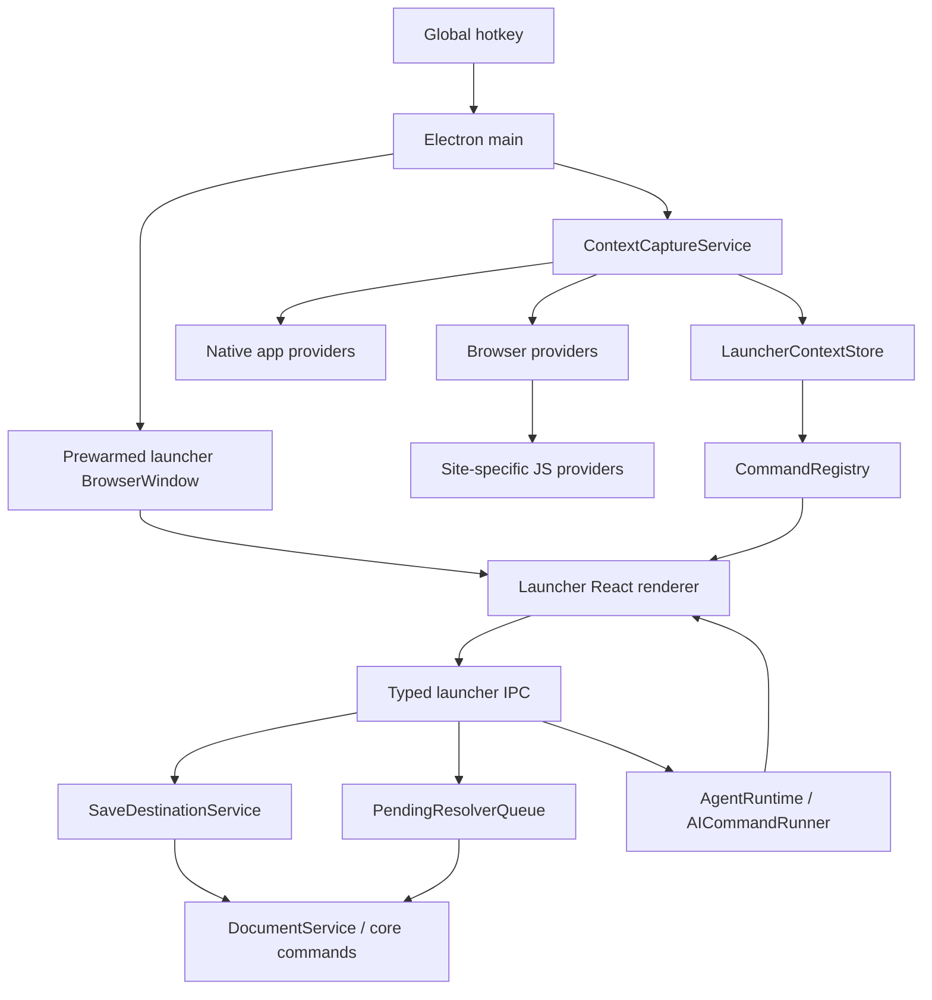

# Lazy-Like Global Launcher

> **⚠️ As-built authority (2026-06-04).** This plan is `in-progress`. The SHIPPED
> behavior is the launcher described in [`../spec/launcher.md`](../spec/launcher.md)
> — read that for what actually works. The slice that landed: the modeless launcher
> + basic-info capture + inline node search + Open main/Settings. Deferred work is
> split into `launcher-ai-actions.md`, `launcher-capture-destinations.md`,
> `launcher-provider-expansion.md`, and `browser-extension-integration.md`.
>
> Large parts of the BODY below still describe the original Lazy-level V1 aspiration
> and are **HISTORICAL design, not the build state** — notably the provider matrix +
> Provider Implementation Details, the `LauncherMode` command state machine,
> Captured content / Pending resolver jobs, the Save Model payload references, the
> "Recommended shared types" listing (the old `CaptureNodeMetadata` with
> payload/resolver fields — the shipped type is **provenance-only**), the Proposed
> new files list, the latency targets (never measured), and the Workstreams /
> Definition of Done. **Trust the code and `../spec/launcher.md` over those
> sections.** Each is marked inline where it would most mislead.

## Purpose

Build a Lazy-level global launcher for Lin Outliner. This is not a small
in-document command palette. The first product release must feel like a full
context capture launcher: global hotkey, instant window, current app/browser
context, context-aware commands, clipping, read-later capture, AI commands,
destination picking, and permission guidance.

This document is intended to be sufficient for a future development agent with
no conversation history. It captures the product target, reverse-engineering
findings, architecture, file-level implementation plan, data contracts, provider
matrix, safety constraints, and acceptance criteria.

## PM-Ratified Decisions (2026-06-03)

Decided with the PM after a code-grounded review of this draft. These **override**
any conflicting prose elsewhere in this document; where an older section still
reflects the pre-review shape, treat this block as authoritative and fix that
section in the same change.

1. **Delivery: one PR, internally phased.** Ship the launcher in a single PR
   organized into ordered phases (see "Implementation Phases" below), NOT as
   separate interface-first PRs. Phase order still follows A7 (foundation before
   consumers). Mechanical consequence the PM accepted: this single PR touches
   infrastructure-ownership files (`src/core/types.ts`, `src/core/commands.ts`,
   `electron.vite.config.ts`, the preload bridge), so siblings rebase once it
   merges — coordinate the merge window.
2. **IP / ToS: approved.** Reverse-engineering Lazy for behavior/architecture
   reference (never code copy) and per-provider DOM extraction are GO. The
   X/Twitter non-automation stance and the "no remote JS, allowlisted local
   scripts only" rule still hold.
3. **Phase 0 feasibility spike is required before the build phases.** The long
   pole is browser in-page JS + native scripting under this project's *unsigned*
   packaging (`mac.identity: null`). Validate it first and report GO/NO-GO to the
   PM before building Phase 1+. Pass criteria in "Phase 0" below.
4. **Security review: skipped.** All capture payloads are local on-device
   storage; the PM judged the data-sensitivity concern out of scope for a
   `/security-review` gate. The non-negotiable Electron security defaults (A3:
   `contextIsolation`/`sandbox`/`nodeIntegration`, navigation + `openExternal`
   allowlists, no remote scripts) still apply and must not regress.

### Foundation references must be calibrated to landed code

This draft repeatedly references a `FileReferenceValue` / `fileRefId` /
`LocalFileRef` shape that **does not exist**. The landed foundation
(`outliner-local-file-references`, archived) is:

- `ReferenceTarget = { kind: 'node'; nodeId } | { kind: 'local-file'; path;
  entryKind }` (`src/core/types.ts`). Local-file identity is the canonical path,
  not an opaque id.
- Inline marker is `[[file:<label>^<path>]]` / `[[node:<label>^<id>]]`
  (`src/core/referenceMarkup.ts`), NOT `[[file:<ref>]]`.
- `asset` and `remote-url` `ReferenceTarget` kinds are explicitly **deferred**
  (added with their consumers).

Consequence for `OriginalResourceRef`: three of its four kinds (`remote-url`,
`asset`, and the old `local-file { file: FileReferenceValue }`) sit on
non-existent or deferred foundation. In Phase 1/3 either (a) extend
`ReferenceTarget` with the needed kinds as part of this PR's foundation phase, or
(b) model the original pointer around the landed path/url shape. Do not write
against the `FileReferenceValue` shape. The type definitions and prose further
down have been calibrated to this; if any stray `FileReferenceValue` /
`LocalFileRef` / `[[file:<ref>]]` mention survives, fix it to this shape.

## Current Project Baseline

Repository root: the active clone under `~/Coding/` (e.g. `lin-outliner`,
`lin-outliner-codex`); use that clone's own `bun run dev:<clone>` script. Earlier
drafts hardcoded the `codex` clone — a merge artifact, not a constraint.

Relevant current files:

- `package.json`
  - Electron 42, electron-vite, React 19, TypeScript.
  - Scripts: `bun run dev:<clone>`, `bun run typecheck`, `bun run test:renderer`,
    `bun run test:e2e`.
- `src/main/main.ts`
  - Owns the current main `BrowserWindow`.
  - Already uses `show: false`, `ready-to-show`, `backgroundColor`,
    `contextIsolation: true`, `nodeIntegration: false`, `sandbox: true`, CSP,
    navigation hardening, and `shell.openExternal`.
  - Does not yet register global hotkeys or create a separate launcher window.
- `src/preload/index.cjs`
  - Existing preload bridge for renderer IPC.
- `src/core/commands.ts`
  - Authoritative command protocol for document and agent commands.
- `src/renderer/ui/CommandPalette.tsx`
  - Current in-app palette only: navigate to Today/Library/Schema/Saved
    searches/Trash, search existing nodes, create a node in Today.
  - This should not become the global launcher. Keep it as the in-document
    palette unless later unified behind shared primitives.
- `docs/spec/architecture.md`
  - Defines runtime boundaries: `src/core`, `src/main`, `src/preload`,
    `src/renderer`.
- `docs/spec/commands.md`
  - Defines command flow and source-of-truth conventions.

Known dirty worktree at document creation time:

- `docs/plans/README.md` modified by someone else.
- `docs/plans/agent-self-modification.md` untracked by someone else.

Do not overwrite those files unless explicitly asked.

## External References

### Official product references

- Lazy home page: https://lazy.so/
  - Public positioning: capture from anywhere, clip information from the current
    app, and use the knowledge base with AI.
- Lazy pricing page: https://lazy.so/pricing
  - Public feature labels observed during research: universal clipper, Kindle
    highlights sync, Capture to Notion, Lazy AI, chat with knowledge base.
- Raycast Quicklinks manual:
  https://manual.raycast.com/quicklinks/how-to-import-quicklinks
- Raycast Snippets manual:
  https://manual.raycast.com/snippets/how-to-import-snippets
- Raycast command aliases and hotkeys:
  https://manual.raycast.com/command-aliases-and-hotkeys
- Raycast settings manual:
  https://manual.raycast.com/settings

### Electron references

- `globalShortcut`: https://www.electronjs.org/docs/latest/api/global-shortcut
  - Global shortcuts work even when the app does not have focus.
  - Must be registered after `app.ready`.
  - Registration can silently fail if the accelerator is taken.
  - Electron 42 includes `globalShortcut.setSuspended()` and
    `globalShortcut.isSuspended()`, useful while rebinding shortcuts.
- `BrowserWindow`: https://www.electronjs.org/docs/latest/api/browser-window
  - `show: false` plus `ready-to-show` avoids first-paint visual flash.
  - `backgroundColor` should be set even when using `ready-to-show`.
  - `backgroundThrottling: false` keeps the window visible to Chromium timers
    and frame scheduling even when hidden.
  - `contextIsolation` and sandbox defaults are documented under
    `webPreferences`.
- Electron security tutorial:
  https://www.electronjs.org/docs/latest/tutorial/security
- `ipcMain`: https://www.electronjs.org/docs/latest/api/ipc-main

### macOS permission references

- `NSAppleEventsUsageDescription`:
  https://developer.apple.com/documentation/bundleresources/information-property-list/nsappleeventsusagedescription
- Electron `systemPreferences`:
  https://www.electronjs.org/docs/latest/api/system-preferences
- macOS trusted accessibility client note from Electron globalShortcut docs:
  media-key accelerators require accessibility trust on macOS 10.14+.

### Platform policy references

- X automation rules: https://help.x.com/articles/20174732
- X developer policy:
  https://developer.x.com/en/developer-terms/policy.html
- X developer guidelines: https://docs.x.com/developer-guidelines

Use these references for risk boundaries. In particular, X/Twitter support must
not become automated scraping, bulk scrolling, posting, liking, replying, DMing,
or follower automation.

### Local reverse-engineering references

Lazy v2.0.10 was extracted during research to:

- `/tmp/lazy-inspect/extracted/build/electron.js`
- `/tmp/lazy-inspect/extracted/build/static/js/main.cb6aa502.js`
- `/tmp/lazy-inspect/extracted/build/static/js/225.5cf07aa7.chunk.js`

These `/tmp` files may not exist in a future session. If absent, use the
findings in this document as the primary reference. If Lazy is installed, a
future agent can re-extract its ASAR from the installed app and repeat static
analysis. Do not copy Lazy code into this product. Use the behavior and
architecture as reference only.

## Product Target

### Release standard

The first release of this feature must be Lazy-like, not a lightweight MVP.
Internal engineering ships as one phased PR (see PM-Ratified Decisions and
Implementation Phases), gated by the Phase 0 feasibility spike. The user-facing
release is not considered complete until the full core set below works together:

- Global launcher window.
- Global hotkey.
- Current external context capture.
- Context-aware command list.
- Capture draft composer.
- Clip and read-later actions.
- AI commands using current source/context.
- Destination picker.
- Provider-specific handling for the highest-value apps/sites.
- Permission status and remediation UI.
- Test harness for provider parsers.

### Non-goals for this plan

- Do not build a Raycast replacement or full third-party extension marketplace.
  Raycast is a UX reference for command launcher interaction, not the product
  scope.
- Do not make an OS-wide app/file launcher in the first release unless it falls
  out of the document/node search system. The core product is knowledge capture.
- Do not implement automated X/Twitter timeline scraping, infinite scroll,
  account actions, posting, liking, following, or DM sending.
- Do not inject remote JavaScript. Provider scripts must be local, versioned,
  reviewed, and allowlisted by hostname/app.
- Do not degrade the existing in-app `CommandPalette`. It remains useful inside
  the main document window.

## Core UX

### Launcher opening

User presses the global shortcut, for example `CommandOrControl+Shift+Space`.

Expected behavior:

1. The prewarmed launcher window appears immediately.
2. Focus is inside the launcher input.
3. The initial list shows stable defaults from memory:
   - New Capture
   - Capture current context
   - Ask AI
   - Recent destinations
   - Permission warning if required

   (Node search is **not** a default command — it is inline: typing matches
   document nodes directly. See the As-built section.)
4. External context capture starts asynchronously.
5. When context arrives, provider-specific commands are inserted without moving
   the selected row unexpectedly.

Latency targets:

- Hotkey to visible window: less than 60 ms warm path.
- Hotkey to input accepting text: less than 80 ms warm path.
- Query to local results update: less than 100 ms for cached/local data.
- External context initial result: best effort under 500 ms.
- Slow resolvers such as article text, YouTube transcript, PDF extraction, and
  tweet thread expansion must never block window display.

### Window behavior

The launcher is a separate, lightweight Electron `BrowserWindow`:

- Precreated at app startup.
- Hidden, not destroyed, after dismissal.
- Independent renderer entry point.
- Frameless or hidden titlebar.
- Always-on-top while active.
- Skips taskbar/dock presence when possible.
- Closes on Escape, blur, successful quick command, or explicit close.
- Does not load the full outliner editor bundle.

Recommended initial constructor shape:

```ts
new BrowserWindow({
  title: 'Lin Launcher',
  width: 760,
  height: 520,
  show: false,
  frame: false,
  resizable: false,
  maximizable: false,
  minimizable: false,
  fullscreenable: false,
  skipTaskbar: true,
  alwaysOnTop: true,
  backgroundColor: prePaintBackgroundColor(),
  webPreferences: {
    preload: join(__dirname, '../preload/index.cjs'),
    contextIsolation: true,
    nodeIntegration: false,
    sandbox: true,
    backgroundThrottling: false,
  },
});
```

Use the existing `prePaintBackgroundColor()` pattern from `src/main/main.ts`.
Apply macOS vibrancy / Windows mica only if it does not introduce flash,
transparency artifacts, or input latency.

### Main views inside the launcher

The launcher renderer is a short-lived command state machine with these views:

- Root command list.
- Search results.
- Capture draft composer.
- Parameter picker.
- Destination picker.
- AI chat/streaming response.
- Permission remediation.
- Error/retry state.

Do not implement these as separate routes initially. Use one renderer entry and
a typed state machine.

### As-built modeless model (PM-ratified 2026-06-03; IA redesign 2026-06-04)

The UX is **modeless**, superseding the earlier "pick New Capture first" framing
above. There is no `Mode` state and no `new-capture` command — a single
always-focused input is simultaneously a **command filter**, a **live node
search**, and a **live capture draft**, so the common path is hotkey → type
(optional) → Enter.

**Presentation (Raycast-style, ratified 2026-06-04).** One **flat** result list,
**no section headers**, where every result renders as the same uniform row:
`glyph · title · subtitle · right-aligned type label`. The type label is the
category — `Command` (capture rows are commands too) or `Node` (a matched document
node; it shows the node's own emoji icon, or a bullet when it has none).
Crucially, the capture row reads as a clear **`Capture`** command (the
page/note is the *subtitle*); the earlier design used the page title as the row
headline, which read like a search result, not a command. Capture rows always use
ONE uniform glyph (it's the same command regardless of what's captured), not a
per-content-type icon. The per-row display is the pure `rowView()` in
`launcherModel.ts`.

The result list is derived purely from `(query, context, nodes, commands)` by
`buildLauncherItems` in `src/renderer/launcher/launcherModel.ts` (unit-tested
without a DOM in `tests/renderer/launcherModel.test.ts`). Ordering — capture rows
first, then matching nodes, then commands:

- **Page context + typed text** → a `capture-page` row (title "Capture") whose
  default action captures the page **with the typed text riding along as the
  capture's comment** (shown in the row subtitle as `+ "…"`). The action label
  stays the plain `Capture page to Today` — there is no "+ note" label variant.
  A `capture-note` row (title "New node") follows as the escape hatch to instead
  make the typed text its own new node.
- **Page context, no text** → a single `capture-page` row (page only).
- **No context, typed text** → a `capture-note` row (title "New node") that creates
  a new node in Today from the typed text.
- **No context, no text** → commands only.
- **Inline node search** → as the user types, matching document nodes appear as
  `node` rows (between captures and commands); Enter **opens** the node in the main
  window. There is **no "Search notes" command** — the input itself is the search.
- Commands are always filtered by the same query and appended last.

Each row carries ordered `actions`; `actions[0]` is what Enter runs. A persistent
**action bar** at the bottom shows that primary label (`↵ …`). **Every shipped row
has exactly one action today** — there are no disabled "coming soon" placeholders.
The `actions: LauncherItemAction[]` array shape is kept so secondary actions are
additive, but the ⌘K secondary-action menu itself was **removed** (it existed only
to show coming-soon stubs) and returns with the features that need it. Deferred,
split into follow-up plans:

- `Save to Inbox`, the destination picker, navigation commands (Go to Today /
  Library), recent destinations, and the **⌘K secondary-action mechanism** →
  `launcher-capture-destinations.md`.
- `Ask AI` (no context) and `Ask AI with source` → `launcher-ai-actions.md`.

Action ids map to IPC in `LauncherApp.tsx`: `capture-page` →
`launcher.createContextCapture({ note })`, `capture-note` →
`launcher.createCapture({ title })`, `open-node` → `launcher.openNode(nodeId)`,
`run-command` → `launcher.executeCommand`. Inline node search uses
`launcher.searchNodes(query)` (debounced; main resolves `search_nodes` hits into
`LauncherNodeMatch` views — node text + parent text — since the locked-down
launcher renderer can't read the document). Opening a node sends
`LAUNCHER_NAVIGATE_TO_NODE_CHANNEL` to the main window, which runs
`navigateRoot + focusNode` (the same jump the in-app CommandPalette uses). The
capture model itself (native fields + tags) is in `sources.ts` /
`core.createCapture`; see Data Contracts below.

## Lazy v2.0.10 Findings

### Lazy's architecture pattern

Static analysis showed three distinct layers:

1. macOS/JXA/AppleScript app context collection in `electron.js`.
2. Browser page JavaScript injected into active tabs for site-specific DOM
   extraction.
3. Frontend parsing and command dispatch in `main.cb6aa502.js`.

Lazy's launcher is not only a search input. It is:

- Command runner.
- Capture editor.
- AI command surface.
- Parameter picker.
- Source/clip resolver.
- Destination selector.
- Permission/settings entry point.

### Lazy command families observed

Observed command strings include:

- Capture:
  - `New Capture`
  - `Capture`
  - `Capture as a Note`
  - `Capture as a Task`
  - `Turn Capture into Note`
  - `Turn Capture into Task`
  - `Turn Note into Capture`
  - `Turn Task into Capture`
- Clip/read later:
  - `Clip article`
  - `Clip Article`
  - `Clip PDF`
  - `Clip email`
  - `Clip video`
  - `Clip Tweet`
  - `Clip tweet(s) from`
  - `Clip DM`
  - `Clip Post`
  - `Read later`
  - `Watch later`
- AI:
  - `Ask Lazy AI`
  - `Ask Lazy AI with Source`
  - `Ask Lazy AI without context`
  - `Summarize`
  - `Summarize article`
  - `Summarize Email`
  - `Summarize PDF`
  - `Summarize video`
  - `Summarize Youtube Video`
  - `Summarize LinkedIn DM`
  - `Summarize LinkedIn Post`
  - `Answer LinkedIn DM`
  - `Generate tags`
  - `Copy last answer`
  - `Regenerate`
- Destination/integration:
  - `Capture to`
  - `Capture location`
  - `Connect Notion workspace`
  - `Manage Notion permissions`
  - `Searching Notion pages...`
  - `Sync Kindle`
  - `Open Kindle window`
- Context management:
  - `Sources`
  - `People`
  - `Events`
  - `Remove context`
  - `Insert selected WhatsApp message`
- Settings/permissions:
  - `Grant Lazy permission`
  - `Open Accessibility`
  - `Go to Settings`
  - `Send Feedback`

### Lazy browser support pattern

Lazy's `electron.js` recognizes the active tab differently by browser family:

- Chromium-family: `Google Chrome`, `Chrome Dev/Canary/Beta`, `Microsoft Edge`,
  Edge variants, `Brave Browser`, `Opera`, `Chromium`, `Tor Browser`,
  `Sidekick`, `Vivaldi`.
- Arc/SigmaOS: active tab access has a different JXA shape.
- Orion: current tab access has a different JXA shape.
- Safari/Safari Technology Preview/WebKit: document-based scripting.
- Firefox: unsupported/no JXA branch in the analyzed build.

For a browser URL, Lazy dispatches by URL/domain:

- `youtube.com` -> YouTube provider.
- `twitter.com` or `x.com` -> Twitter/X provider.
- `mail.superhuman` -> Superhuman provider.
- `slack.com/client` -> Slack web provider.
- `mail.google.com` -> Gmail provider.
- `linkedin.com/messaging/thread` -> LinkedIn messaging provider.
- LinkedIn feed/posts/search/recent activity -> LinkedIn post/feed provider.
- `linkedin.com/in/` -> LinkedIn profile provider.
- `web.whatsapp` -> WhatsApp provider.
- `loom.com` -> Loom provider.
- Everything else -> generic webpage provider with special cases.

### Lazy site/app provider matrix

Use this as the first-release provider target.

| Provider | Lazy-level extraction | Commands to enable |
| --- | --- | --- |
| Generic webpage | URL, title, canonical, description, image, author, published date, JSON-LD, Open Graph/Twitter metadata. Special cases for Notion public pages, TechCrunch, Medium, Amazon products, Substack, Circle, GitHub. | Capture page, Clip article, Read later, Ask AI with source, Summarize article. |
| YouTube / Shorts | Current playback position, duration, title, author name/avatar/url, JSON-LD. Lazy also resolves transcript around the current timestamp. | Clip video, Watch later, Summarize video, Ask AI with timestamp context. |
| X/Twitter | Selected tweet, hovered tweet, current status URL, DM header. Lazy later fetches tweet/thread/media through an API interface. | Clip tweet, Read later, Summarize tweet/thread, Ask AI with tweet. |
| Gmail Web | Main thread HTML and selected message HTML. | Clip email, Read later, Summarize email, Ask AI with email. |
| Superhuman Web | Contact pane, focused selected message through Shadow DOM, subject, content. | Clip email, Read later, Summarize email. |
| Apple Mail | Selected message, sender, recipients, date sent, mailbox, attachments, body, `message://` link. | Clip email, Read later, Summarize email. |
| Mimestream | Current selected email title/link; Lazy also fetches a page and finds a button link. | Clip email, Read later. |
| LinkedIn Messaging | DM participant profile URL/name/job/avatar and visible message content. | Clip DM, Summarize LinkedIn DM, Answer LinkedIn DM. |
| LinkedIn Feed/Post/Profile | Profile/post author, content, post/profile URL. | Clip Post, Read later, Summarize LinkedIn Post. |
| Slack Web | Channel/member title, selected message, message link, author, workspace name/avatar. | Capture message, Ask AI with Slack context. |
| Slack Desktop | Lazy reads Slack local state/log files to restore workspace/channel URL. | Capture channel/message context. |
| WhatsApp Web | Chat name/avatar/subtitle, visible messages, selected/hovered message, time, author, media/audio/forwarded flags. | Capture chat context, insert selected message, Ask AI with chat context. |
| Loom | Current position, duration, video source, author, avatar, published date, JSON-LD. | Clip video, Summarize video. |
| Spotify | Current track, artist, album, artwork, duration, player position, timestamped source URL. | Capture track/source. |
| Messages | Conversation participant handle/name/phone. | Capture conversation source. |
| PDF / Acrobat | Active document file path/name; Lazy has PDF clip/read-later and PDF summarize. | Clip PDF, Read later, Summarize PDF. |
| Apple Books / GoodNotes | Title/URL cleanup for active document/book. | Capture source. |
| Circle.so | Current visible/selected/hovered post, author, avatar, title, URL, cleaned content. | Clip Article, Read later, Summarize article. |
| GitHub | Repo/profile route pattern, owner/user avatar, author/source. | Capture repo/profile, Ask AI with source. |
| Notion public pages | Title/author extraction for `notion.site` and `notion.so`; Notion workspace integration separately supports capture destinations. | Capture page, Capture to Notion destination. |
| Substack | Feed item/note/post title, URL, author, avatar. | Clip article/note, Read later. |
| Kindle integration | Sync Kindle books/highlights. | Sync Kindle, View in Kindle. |

## Architecture

### High-level flow



### Runtime boundaries

Keep the existing repository boundaries:

- `src/main`
  - Owns windows, global hotkeys, OS permissions, AppleScript/JXA execution,
    local file access, provider execution, resolver jobs, and document writes.
- `src/preload`
  - Exposes narrow launcher IPC under the existing `window.lin` bridge or a
    new `window.lin.launcher` namespace.
- `src/core`
  - Owns protocol types, document mutations, source/capture metadata schemas,
    and persistence-compatible data shapes.
- `src/renderer`
  - Owns launcher UI, keyboard interaction, list rendering, AI streaming view,
    parameter pickers, and optimistic state.

### Proposed new files

Use these names unless there is a strong reason to fit a different local
pattern.

```txt
src/core/launcher/
  commands.ts
  context.ts
  providers.ts
  sources.ts
  state.ts

src/main/launcher/
  launcherWindow.ts
  launcherHotkey.ts
  launcherIpc.ts
  commandRegistry.ts
  launcherSession.ts
  saveDestinationService.ts
  aiCommandRunner.ts

src/main/context/
  ContextCaptureService.ts
  ExternalContextStore.ts
  permissions.ts
  osascript.ts
  providerRunner.ts
  providers/
    browser.ts
    browserScripts.ts
    genericWebpage.ts
    youtube.ts
    xTwitter.ts
    gmail.ts
    linkedin.ts
    slack.ts
    whatsapp.ts
    loom.ts
    mail.ts
    messages.ts
    spotify.ts
    pdf.ts
  resolvers/
    articleResolver.ts
    youtubeTranscriptResolver.ts
    tweetResolver.ts
    pdfTextResolver.ts
    metadataResolver.ts

src/renderer/launcher/
  LauncherApp.tsx
  LauncherInput.tsx
  LauncherList.tsx
  LauncherCommandRow.tsx
  LauncherCaptureComposer.tsx
  LauncherDestinationPicker.tsx
  LauncherParameterPicker.tsx
  LauncherAiPanel.tsx
  launcherReducer.ts
  launcherApi.ts
  launcherSearch.ts
  launcherIcons.tsx

src/renderer/styles/
  launcher.css

tests/launcher/
  provider-fixtures/
  providerRunner.test.ts
  commandRegistry.test.ts
  sourceModel.test.ts

tests/e2e/
  launcher-window.spec.ts
  launcher-capture.spec.ts
```

### Vite/Electron entry points

Add a second renderer entry for the launcher. Do not load the full main app
bundle when only the launcher is needed.

Desired shape:

```txt
src/renderer/index.html          existing main app
src/renderer/launcher.html       new launcher app
src/renderer/launcher/main.tsx   mounts LauncherApp
```

If electron-vite config currently assumes a single renderer entry, extend it
carefully and verify packaged output. The launcher entry must share design
tokens and primitive components where cheap, but it must not import heavy editor
paths, ProseMirror, Shiki, markdown rendering, or the main document projection
unless explicitly needed.

## Data Contracts

Put stable shared types in `src/core/launcher/*`. Keep renderer-only UI state in
`src/renderer/launcher/*`.

> **Status (2026-06-04): the payload/resolver/content types below were REMOVED.**
> The as-built contracts are leaner than this section's original design. Removed:
> `ContextSelection`, `CapturedContent`, `CapturedMedia`, `ResolverKind`,
> `PendingResolverJob`, `CapturePayloadRef`, `CaptureResolverRef`, and the
> `selection`/`content`/`media`/`raw` fields on `ExternalContext`. The capture
> sidecar (`CaptureNodeMetadata`) is **provenance-only** (source identity, origin,
> `status: 'saved' | 'partial'`, warnings — no payloadRefs/resolverJobs). Capture is
> basic-info only; body/transcript/media extraction returns with the unified
> extension/CDP backend (`docs/plans/browser-extension-integration.md`), which will
> design its own storage model. The original type listings are retained below as the
> record of the deferred design.

### Provider identifiers

```ts
export type ContextProviderId =
  | 'generic-webpage'
  | 'youtube'
  | 'x-twitter'
  | 'gmail'
  | 'superhuman'
  | 'apple-mail'
  | 'mimestream'
  | 'linkedin'
  | 'slack'
  | 'whatsapp'
  | 'loom'
  | 'spotify'
  | 'messages'
  | 'pdf'
  | 'github'
  | 'circle'
  | 'substack'
  | 'notion-public'
  | 'unknown-app';
```

### External context

```ts
export interface ExternalContext {
  id: string;
  capturedAt: string;
  captureOrigin: 'global-hotkey' | 'manual-refresh' | 'deep-link' | 'test';
  app: {
    name: string;
    bundleId?: string;
    windowTitle?: string;
  };
  browser?: {
    name: string;
    tabTitle?: string;
    url?: string;
    hostname?: string;
  };
  providerId: ContextProviderId;
  confidence: 'exact' | 'probable' | 'fallback';
  source?: SourceDraft;
  selection?: ContextSelection;
  content?: CapturedContent;
  media?: CapturedMedia;
  raw?: unknown;
  warnings: ContextWarning[];
  permissions: PermissionRequirement[];
}
```

### Source draft

```ts
export interface SourceDraft {
  kind:
    | 'webpage'
    | 'article'
    | 'video'
    | 'tweet'
    | 'email'
    | 'chat'
    | 'profile'
    | 'repo'
    | 'pdf'
    | 'music'
    | 'app';
  title: string;
  original: OriginalResourceRef;
  url?: string;
  canonicalUrl?: string;
  appUrl?: string;
  author?: {
    name?: string;
    handle?: string;
    url?: string;
    avatarUrl?: string;
  };
  imageUrl?: string;
  publishedAt?: string;
  timestampSeconds?: number;
  durationSeconds?: number;
  providerId: ContextProviderId;
  metadata?: Record<string, unknown>;
}

// Calibrated to landed code (see "Foundation references" above). The shared
// identity type is `ReferenceTarget` from src/core/types.ts:
//   { kind: 'node'; nodeId } | { kind: 'local-file'; path; entryKind }
// `asset` and `remote-url` ReferenceTarget kinds are deferred; until they land,
// model those original pointers directly here. Do NOT reference FileReferenceValue.
export type OriginalResourceRef =
  | {
    kind: 'remote-url';
    url: string;
    canonicalUrl?: string;
    preview: 'web-preview' | 'external-browser';
  }
  | {
    kind: 'local-file';
    // canonical absolute path = identity, matching ReferenceTarget local-file
    path: string;
    entryKind: 'file' | 'directory';
    // optional capture-time snapshots for broken-state rendering
    displayName?: string;
    mimeType?: string;
    sizeBytes?: number;
    modifiedAt?: string;
    contentHash?: string;
    preview: 'text' | 'image' | 'pdf' | 'native-open' | 'unsupported';
  }
  | {
    kind: 'asset';
    assetId: string;
    name?: string;
    mimeType?: string;
    preview: 'asset-preview' | 'native-open';
  }
  | {
    kind: 'app-resource';
    appUrl?: string;
    externalUrl?: string;
    preview: 'app-open' | 'external-browser' | 'unsupported';
  };
```

### Captured content

> **HISTORICAL — not built.** `CapturedContent`/`CapturedMedia` and the whole
> in-app content/selection/media extraction were removed (basic-info-only capture).
> Rich content returns via `browser-extension-integration.md`. Kept as design record.

```ts
export interface CapturedContent {
  format: 'plain-text' | 'html' | 'markdown' | 'json';
  text?: string;
  html?: string;
  markdown?: string;
  json?: unknown;
  clippedRange?: {
    startSeconds?: number;
    endSeconds?: number;
  };
  needsResolver?: ResolverKind[];
}

// CapturePayloadRef is defined once, canonically, in the Save Model section
// (src/core/launcher/sources.ts) using `role` + `searchPolicy`. It is NOT
// redefined here. The earlier `storage`/`visibility` variant was a duplicate and
// has been removed to avoid two authorities.

export type ResolverKind =
  | 'article-body'
  | 'youtube-transcript'
  | 'tweet-thread'
  | 'pdf-text'
  | 'remote-metadata'
  | 'notion-destination';
```

### Launcher command

```ts
export interface LauncherCommand {
  id: string;
  title: string;
  subtitle?: string;
  searchText: string;
  group:
    | 'Capture'
    | 'Clip'
    | 'AI'
    | 'Navigate'
    | 'Destination'
    | 'Context'
    | 'Integration'
    | 'Settings'
    | 'Debug';
  icon: LauncherIconId;
  rank: number;
  shortcutHint?: string;
  enabled: boolean;
  disabledReason?: string;
  visibleWhen: LauncherCommandVisibility;
  params?: LauncherParameterSpec[];
  run: LauncherCommandRunSpec;
}
```

The serializable command definition should live in the main process. The
renderer receives command views and invokes by `commandId` plus parameter values.
Do not send functions over IPC.

### Command state machine

> **HISTORICAL — not built.** There is no `LauncherMode` / mode state machine in
> the shipped launcher: the model is modeless (one input = filter + search + capture
> draft), built purely in `launcherModel.ts`. See the As-built section + `../spec/launcher.md`.

```ts
export type LauncherMode =
  | 'root'
  | 'searching'
  | 'capture-composer'
  | 'selecting-parameter'
  | 'selecting-destination'
  | 'executing'
  | 'ai-streaming'
  | 'success'
  | 'error'
  | 'permission-required';
```

The reducer must make all transitions explicit. Avoid ad-hoc boolean state such
as `isPickerOpen`, `isAiOpen`, `isCaptureOpen` without a single authoritative
mode.

### Pending resolver jobs

```ts
export interface PendingResolverJob {
  id: string;
  sourceId: string;
  contextId: string;
  kind: ResolverKind;
  status: 'queued' | 'running' | 'succeeded' | 'failed' | 'cancelled';
  attempts: number;
  createdAt: string;
  updatedAt: string;
  input: unknown;
  error?: string;
}
```

Resolvers run after the immediate capture has already created a source/capture
node. They update the node/source when complete.

## Command Registry

### Static default commands

> **As-built note (2026-06-04).** The list below is the *original design
> aspiration*. What actually ships is far smaller and contains **no disabled
> placeholders**: `getStaticLauncherCommands()` returns only **Open main window**
> and **Open Settings**. "New Capture" became the input itself (capture-first);
> node search became inline (no command). The rest were split into follow-up
> plans and will be added here only when they work:
> - AI commands → `launcher-ai-actions.md`
> - Go to Today / Library, recent destinations → `launcher-capture-destinations.md`

These commands were the original always-available set:

- New Capture
- Ask AI without context
- Ask AI with latest context if one exists
- Go to Today
- Go to Library
- Open main window
- Open Settings
- Permission status

### Context-aware commands

Commands inserted after context capture:

- Generic webpage:
  - Capture page
  - Clip article
  - Read later
  - Summarize article
- YouTube:
  - Capture video timestamp
  - Clip video
  - Watch later
  - Summarize video
- X/Twitter:
  - Capture tweet
  - Clip tweet
  - Read later
  - Summarize tweet/thread
- Gmail/Superhuman/Apple Mail:
  - Clip email
  - Read later
  - Summarize email
- LinkedIn DM:
  - Clip DM
  - Summarize LinkedIn DM
  - Answer LinkedIn DM
- LinkedIn post:
  - Clip Post
  - Read later
  - Summarize LinkedIn Post
- PDF:
  - Clip PDF
  - Read later
  - Summarize PDF
- WhatsApp:
  - Capture chat
  - Insert selected message
  - Ask AI with chat context
- Slack:
  - Capture message/channel
  - Ask AI with Slack context
- Spotify:
  - Capture track

### Parameterized commands

Do not open a separate modal for command parameters. Use the launcher list.

Examples:

- Capture to...
  - Today
  - Inbox
  - Current node
  - Search node by query
  - Notion destination, once integration exists
- Ask AI with source...
  - Current context
  - Current node
  - Selected previous capture
- Context type...
  - Source
  - Person
  - Event
- Create...
  - Capture
  - Note
  - Task

## Context Capture Service

### Service contract

`ContextCaptureService.captureCurrentContext()` should:

1. Determine frontmost app.
2. If app is a supported browser, get active tab URL/title and run the matching
   site provider script.
3. If app is a native supported app, run the native provider.
4. If no provider matches, return an `unknown-app` context with app/window title.
5. Enforce per-provider timeout.
6. Return structured `ExternalContext` plus warnings and permission needs.

Suggested timeout budget:

- Frontmost app detection: 120 ms.
- Browser active tab title/URL: 250 ms.
- Site JS provider: 400 ms.
- Native app provider: 500 ms.
- Total initial context budget: 900 ms.
- Slow resolvers: queued separately, not part of initial context.

### AppleScript/JXA execution

Implement a small, audited wrapper:

```ts
export async function runOsascript(input: {
  language: 'AppleScript' | 'JavaScript';
  script: string;
  timeoutMs: number;
}): Promise<{ stdout: string; stderr: string }>;
```

Rules:

- Always apply a timeout and kill the child process on timeout.
- Never interpolate unescaped user input directly into a script.
- Prefer JSON output from scripts.
- Log provider id, duration, and error category in development.
- Strip or redact captured content from logs by default.

### Browser provider

The browser provider is responsible for:

- Detecting active browser by app name/bundle id.
- Getting active tab URL/title.
- Selecting a site provider by URL hostname/path.
- Running allowlisted JS inside the active tab.
- Returning generic metadata if no site provider matches.

Supported first-release browsers:

- Google Chrome stable/dev/canary/beta.
- Microsoft Edge stable/dev/canary/beta.
- Brave Browser.
- Arc.
- Safari and Safari Technology Preview.
- Chromium.
- Opera.
- Vivaldi.
- Orion if practical.

Firefox is unsupported for first release unless a reliable, consented integration
is added. Return a permission/provider warning instead of pretending it works.

### Accessibility-authoritative tab capture (multi-window / multi-instance)

**Problem.** The AppleScript path addresses a browser by **bundle id** and reads
`active tab of front window`. That returns the wrong page in two real cases:

1. **Multiple windows** — `front window` is the app's internally-frontmost window,
   not guaranteed to be the one the user sees.
2. **Multiple instances of the same browser** (two profiles / `--user-data-dir`)
   — AppleScript can only address one instance per bundle id, so it may read the
   wrong instance's tab entirely. (This was the observed `csp-spike` capture.)

Correct capture is a baseline-experience requirement, so this is not left to the
AppleScript heuristic. The ecosystem consensus (Alfred, Raycast) is the
**Accessibility (AX) API**: it identifies the focused window by **PID + key
focus**, not by bundle + "front window".

**Mechanism.** A native macOS addon (`native/browser-tab`, sibling of
`window-corner`; loader `src/main/context/nativeBrowserTab.ts`) exposes:

- `accessibilityTrusted()` — `AXIsProcessTrusted()`, no prompt.
- `promptAccessibility()` — triggers the system grant prompt.
- `getFocusedTab(pid)` — `AXUIElementCreateApplication(pid)` →
  `kAXFocusedWindowAttribute` → a shallow, budgeted DFS for the first
  `kAXURLAttribute` (Chrome `AXWebArea` / Safari web area expose it); returns
  `{url, title, error}`. Bounded (depth 7 / 300 nodes / 0.4s messaging timeout) so
  it can't hang the main process; never throws.

The frontmost-app read now also returns the **PID** (`NSWorkspace
.frontmostApplication.processIdentifier`), captured before focus is stolen.

**Merge policy (in the pure `normalizeWebpageContext`).** The AX URL is
**authoritative** when present (a real `http(s)` URL). The AppleScript `tab`/`page`
reads still run (in parallel) for rich metadata (og:title, author, published,
selection). Then:

- **AX URL agrees with the scripted URL** → keep the rich metadata; `confidence
  = exact`.
- **AX URL disagrees** → the bridge read a different window/instance: trust AX
  (url + window title, browser-name suffix stripped), **drop** the mismatched
  metadata, record a `context-window-mismatch` warning; `confidence = probable`.
- **No AX URL** (untrusted / addon missing / off-darwin) → existing front-window
  behavior unchanged (graceful degradation). When AX is merely untrusted,
  `macos-accessibility` is added to the context's `permissions` so a remediation
  UI can offer the more reliable path.

**Permission.** AX needs the Accessibility TCC grant (distinct from
Automation/Apple Events). It is already in `PermissionRequirement`
(`macos-accessibility`). A first-run grant affordance (calling
`promptAccessibility`) is a later phase; until then capture works via the
AppleScript fallback and the grant is done in System Settings.

### Site JS injection rules

Provider scripts must be read-only and local:

- Store scripts as TypeScript functions in `src/main/context/providers`.
- Build them into strings with `function.toString()` wrappers or a small local
  bundling helper.
- Do not fetch script content from the network.
- Do not mutate page state.
- Do not click, scroll, type, post, like, follow, or send messages.
- Match by allowlisted host/path.
- Return plain JSON-serializable data.
- Catch selector errors inside the page script and return partial results.

Example shape:

```ts
export function youtubePageScript() {
  const video = document.querySelector('ytd-watch-flexy video, ytd-shorts video') as HTMLVideoElement | null;
  return {
    playerPosition: video?.currentTime,
    duration: video?.duration,
    title: document.querySelector('h1')?.textContent?.trim(),
    jsonLD: [...document.querySelectorAll('script[type="application/ld+json"]')]
      .map((node) => node.textContent)
      .filter(Boolean),
  };
}
```

The execution wrapper serializes this function and evaluates it in the active
tab via the browser's scripting interface.

## Provider Implementation Details

> **Status (2026-06-04): all in-app rich extraction was REMOVED.** Capture runs
> basic-info-only (URL + title + app + URL-derived classification). Two clean
> deletions: (1) the AppleScript in-page page-script path, then (2) the offscreen
> YouTube transcript resolver + the whole payload/resolver apparatus
> (`resolverRunner`, `captureStore`, the `apply_capture_resolver_result` command,
> `CapturePayloadRef`/`CaptureResolverRef`/`CapturedContent`/`CapturedMedia`). Body,
> transcript, and media extraction are deferred wholesale to the unified browser
> extension / CDP backend — see `docs/plans/browser-extension-integration.md`.
> Provider *classification* still runs from the URL (`selectSiteProvider` +
> `enrich*Context`), and rich page metadata returns when a `PageContentExtractor`
> (the extension) supplies `raw`. The capture sidecar is now provenance-only. The
> detail below documents the intended rich behavior the extension will restore.

### Generic webpage

Extract:

- `document.title`.
- `location.href`.
- Canonical URL.
- `meta[name=description]`.
- Open Graph title/description/image/type/url.
- Twitter card title/description/image.
- `article:published_time`, `article:modified_time`, author tags.
- JSON-LD scripts.

Use existing dependencies:

- `defuddle` for article extraction where it fits.
- `linkedom` for server-side HTML parsing in resolvers.

Special cases to implement:

- Notion public pages: better page title from Notion DOM when standard metadata
  is weak.
- Medium: author/avatar extraction.
- Substack: selected/hovered/visible feed item or post.
- GitHub: repo/profile owner/avatar/source.
- Circle.so: current visible/selected post, cleaned content.
- Amazon product pages: product image fallback.

### YouTube

Initial context (LANDED, cc-2):

- Standard YouTube and Shorts support; classified as `#video` from the URL alone
  (so a watch/Shorts link is a video with no rich data needed).
- Channel author is added when a `PageContentExtractor` (future extension) supplies
  `raw`; with no extractor the video is captured by URL identity only.
- **PM decision (2026-06-03): player position + duration are NOT surfaced.** No
  `Timestamp`/`Duration` node fields, and the captured URL is the clean canonical
  `watch?v=<id>` (the `&t=` anchor was judged noise). Position/duration are no longer
  captured at all (the invisible `media` model was removed with the resolver path).

Transcript resolver (REMOVED 2026-06-04 — rebuilt on the unified backend):

> The offscreen transcript resolver was built, then removed by clean deletion along
> with the payload/resolver apparatus. Transcript extraction returns as a
> first-class capability of the browser extension / CDP backend
> (`docs/plans/browser-extension-integration.md`), on one path — not as a separate
> offscreen-scrape mechanism kept alive in the meantime. The research below is
> retained because it still informs that future implementation.

- **Extraction (verified 2026): only in-page DOM scraping works.** InnerTube
  `get_transcript`, caption `baseUrl` fetch (even same-origin), and page-HTML
  scraping all fail now (FAILED_PRECONDITION / 0 bytes / LOGIN_REQUIRED). The
  reliable path is: confirm captionTracks → click "Show transcript" → read
  `transcript-segment-view-model`. Reference impls in sibling clones
  (`nodex-claude/docs/research/youtube-transcript-extraction.md`,
  `sider-agent/.../web/library/youtube.js`).
- The extension reads it in-page via its content script; storage model for the
  transcript (the old payload-to-file sidecar is gone) is an open question for the
  successor plan. Clean session → public videos (~97%); login/age-gated fail gracefully.
- Do not run playlist or channel crawling.

Commands:

- Capture video timestamp.
- Clip video.
- Watch later.
- Summarize video.
- Ask AI with timestamp context.

### X/Twitter

Initial context:

- Detect selected tweet article via current selection.
- Detect hovered tweet article.
- Detect current `/status/` URL.
- Detect DM header only as context, not for sending.

Allowed behavior:

- Read the current visible tweet/status context from the page DOM.
- Resolve a single user-triggered tweet/thread if a compliant API path exists.
- Store source metadata and user-requested clip text.

Disallowed behavior:

- No timeline crawling.
- No infinite scroll.
- No bulk tweet collection.
- No likes/reposts/follows/replies/DM sends.
- No account automation.
- No hidden repeated polling.

Risk stance:

- Default to DOM-only for first release.
- Gate any network/API tweet resolver behind a feature flag and policy review.
- Show a provider warning when only partial context is available.

### Gmail Web

Initial context:

- Main thread area HTML.
- Selected message HTML if selection is inside a message.
- Subject/title where available.
- Sender and date where feasible.

Commands:

- Clip email.
- Read later.
- Summarize email.
- Ask AI with email.

Implementation note:

- Gmail DOM selectors are brittle. Build fixtures from sanitized saved HTML and
  unit-test extraction.

### Superhuman Web

Initial context:

- Contact pane.
- Focused expanded message via Shadow DOM.
- Subject.
- Plain content.

This provider can be lower priority than Gmail/Apple Mail if time is tight, but
the architecture must support it.

### Apple Mail

Use AppleScript/JXA to get:

- Selected message.
- Sender.
- Recipients.
- Date sent.
- Mailbox.
- Body.
- Attachments.
- `message://` URL.

Permission:

- Requires Automation/Apple Events permission.
- `NSAppleEventsUsageDescription` must be present in packaged app metadata.

### LinkedIn

Messaging:

- DM participant name/profile/job/avatar.
- Visible messages with sender, time, text.

Feed/post/profile:

- Current post/profile URL.
- Author name/profile/avatar.
- Post content if visible.

Commands:

- Clip DM.
- Summarize LinkedIn DM.
- Answer LinkedIn DM. The answer command drafts text only. It must not send.
- Clip Post.
- Summarize LinkedIn Post.

### Slack

Web:

- Workspace name/avatar.
- Channel/member title.
- Selected message if selection is inside a Slack virtual list item.
- Message link, author, content.

Desktop:

- Investigate whether Slack local state/logs are available and stable enough.
- Do not depend on Slack internals without a fallback.
- If local state is unavailable, return app/window context only.

### WhatsApp Web

Extract:

- Current chat name, avatar, subtitle.
- Visible messages.
- Selected or hovered message.
- Text, time, author, incoming/outgoing flag.
- Media/audio/forwarded/date-row flags.

Commands:

- Capture chat.
- Insert selected message.
- Ask AI with chat context.

Do not send messages.

### PDF / Acrobat

Initial context:

- Active PDF path or URL.
- File name/title.

Resolver:

- Extract text with a local PDF parser if dependency exists or add one after
  evaluation.
- Store page-level highlights if the user selected text.

Commands:

- Clip PDF.
- Read later.
- Summarize PDF.

### Spotify

Use native app scripting when possible:

- Current track.
- Artist.
- Album.
- Artwork.
- Duration.
- Current player position.
- URL with timestamp fragment.

Command:

- Capture track.

### Messages

Use native app scripting when possible:

- Conversation title.
- Participant names/handles/phone numbers.

Command:

- Capture conversation source.

Do not send messages.

## Save Model

> **PARTLY HISTORICAL.** The capture-node + outline-projection + `create_capture`
> transaction shipped. But the **hidden payload references / raw-payload storage /
> resolver-job** parts of this section were removed — the sidecar is provenance-only
> (`CaptureNodeMetadata` in `sources.ts`). Preview / open-original / local-file
> capture are deferred (see the split plans). Read `../spec/launcher.md` for what's real.

The launcher saves captures into the existing document model. Do not create a
second primary capture database. The durable source of truth stays the
`workspace.loro.json` file written by `DocumentService`, so captures participate
in search, backlinks, undo/redo, projection updates, agent tools, and future
sync exactly like other nodes.

Current persistence facts:

- `DocumentService` loads/saves `workspace.loro.json`.
- `Core` owns document mutations.
- `LoroOutlinerDocument` persists node scalar fields listed in
  `NODE_SCALAR_KEYS`.
- `NodeBase` currently has no generic JSON metadata field.
- `AssetService` stores binary assets under `userData/assets`, and document
  nodes reference assets by `assetId`.

Therefore the first implementation should add a typed capture metadata field to
nodes, not use an external DB as the primary store.

### Original resource vs captured snapshot

Every capture must preserve both concepts:

- **Original resource**: the live place the user can reopen later.
  - Webpage: active tab URL, canonical URL, app URL, or timestamped video URL.
  - Local file: absolute file path plus name, MIME type, modified time, size,
    and optional content hash.
  - Stored asset: `assetId`.
  - App resource: `message://...`, Spotify track URL, Slack message URL, etc.
- **Captured snapshot**: the content we saved at capture time.
  - Cleaned article body.
  - Selected email/message/tweet.
  - Transcript excerpt.
  - User note.
  - AI answer.

Do not conflate them. Opening the original resource may show newer remote
content or a changed local file. The saved snapshot should still show what was
captured when the user pressed the shortcut.

The original pointer lives at `capture.source.original` and uses the
`OriginalResourceRef` union defined in the data-contract section.

### Hidden payload references

**LANDED (cc-2, 2026-06-03): the at-capture content-payload pipeline.** Generic
webpage captures now extract a bounded readable body (read-only, in-page) plus any
selection AT capture time and store them as files under
`userData/captures/<captureId>/` (`content.txt` `role:'cleaned-text'`,
`selection.txt` `role:'selected-text'`), referenced by `capture.payloadRefs[]`
with `searchPolicy: 'metadata-only'`. The capture node stays clean (title + URL +
author); the snapshot never enters the outline. Store: `src/main/launcher/
captureStore.ts` (path-fenced read, byte-capped write, root injected for tests).
Pure ref builder: `buildCapturePayloadRef` in `src/core/launcher/sources.ts`.
Done AT capture time (not deferred), honoring the local-extraction preference (no
URL re-fetch — login-walled content would be lost).

**Payloads are AGENT-FACING, not a user preview (PM decision 2026-06-03).** The
consumer of `capture.payloadRefs` is the agent resource-context builder: when a
capture node is referenced into a chat (or via "summarize this capture"), main
reads the payload file and injects it into the agent context. There is no
user-facing payload Preview/Open UI. DEFERRED to later slices: the resolver runner
(async job queue), the system-origin payload **write-back command** (protocol;
needed when a resolver updates the node after save), the **agent-context wiring**
that reads payloads into a chat, and re-host resolvers (YouTube transcript via the
hidden webContents above; server-fetched article body only where re-fetch is
acceptable).

Do not store captured full text as ordinary child nodes by default. Full webpage
text, email bodies, chat logs, tweet threads, transcripts, and PDF text can
pollute the user's knowledge base if they appear as normal outline content.

Store full captured content as hidden payloads:

```txt
capture.payloadRefs[]
  -> userData/captures/<captureId>/content.md
  -> userData/captures/<captureId>/raw.html
  -> userData/captures/<captureId>/transcript.json
  -> asset://<assetId>
  -> original local file path
```

`CapturePayloadRef.visibility` controls knowledge visibility:

- `hidden`: default. Payload is available to Preview, Open, resolver retry, and
  explicit AI commands such as "summarize this capture", but it is not rendered
  as ordinary outliner content and should not be part of default full-text
  search or ambient agent context.
- `excerpt-visible`: only a short excerpt/summary is saved as visible outline
  content. The full payload remains hidden.
- `indexed`: opt-in. The payload may be indexed and treated as knowledge-base
  content. This should require an explicit user action such as "Add full article
  to knowledge base" or "Import file text".

This is the hidden system field the capture feature needs. Implement it as typed
metadata on `node.capture.payloadRefs`, not as a normal visible `fieldEntry`.
If a future UI wants to expose it as a system field, the field must be marked
system-owned, hidden by default, and excluded from normal outline rendering.

### Preview and open behavior

Capture cards should expose two separate actions:

- **Preview original**: open a preview of the live original resource.
- **Open original**: open the original in the system/browser/app.

Preview routing:

| Original kind | Preview behavior | Open behavior |
| --- | --- | --- |
| `remote-url` | Open a dedicated web preview surface or external browser fallback. Do not iframe into the main renderer because current CSP has `frame-src 'none'`. | Use `shell.openExternal` through an allowlisted http(s)-only command. |
| `local-file` text | Main process reads a bounded text preview by capture id/source id, then renderer displays it. | Use `shell.openPath(path)` from main process. |
| `local-file` image | Main process returns thumbnail or local preview URL if allowed. Existing thumbnail helpers can be reused. | Use `shell.openPath(path)`; reveal uses `shell.showItemInFolder(path)`. |
| `local-file` PDF | Dedicated PDF preview or text excerpt resolver; open native app as fallback. | Use `shell.openPath(path)`. |
| `asset` | Render through `asset://<assetId>` using existing `AssetService`. | Use existing `open_asset` / `reveal_asset`. |
| `app-resource` | Provider-specific preview if supported, otherwise show source summary. | Use app URL, `message://`, or external URL through main process. |

Important security rule: the renderer must not be given a generic
`open file path` primitive. It may request `previewOriginal({ nodeId })` or
`openOriginal({ nodeId })`; the main process looks up the saved capture metadata
and decides whether the operation is allowed.

For remote URLs, keep the existing policy from `open_external_url`: only
`http://` and `https://` can go through `shell.openExternal`. Never pass
`file://`, custom schemes, or untrusted URLs through that command.

For local files, do not convert paths to `file://` and load them in the
renderer. Local preview should be mediated by main-process IPC:

```ts
export interface PreviewOriginalRequest {
  captureNodeId: NodeId;
}

export type PreviewOriginalResult =
  | { kind: 'web'; url: string; mode: 'external-browser' | 'preview-window' }
  | { kind: 'text'; name: string; text: string; truncated: boolean }
  | { kind: 'image'; name: string; thumbnailDataUrl: string }
  | { kind: 'pdf'; name: string; assetId?: string; textExcerpt?: string }
  | { kind: 'summary'; title: string; lines: string[] }
  | { kind: 'missing'; reason: string };
```

Suggested commands:

- `launcher:previewOriginal`
- `launcher:openOriginal`
- `launcher:revealOriginal`

These launcher commands should not share the renderer-exposed `ingest_asset`
path handling. Path reads remain main-process-only.

### Local file durability

For a local file capture, decide whether the capture is a reference or an
attachment:

- **Reference mode**:
  - Store path/mtime/size/hash in `original`.
  - Do not copy the file.
  - If file moves or changes, preview can return `missing` or `changed`.
- **Attachment mode**:
  - Copy bytes through `AssetService`.
  - Store both `original.kind = 'local-file'` and an `artifactRef` with
    `assetId`.
  - Preview can still work even if the original file disappears.

Default:

- Local file captures use reference mode only. Store the original absolute path
  plus lightweight file metadata; do not copy bytes into app storage by default.
- Text/source files may store a bounded hidden preview payload for fast preview,
  but the file itself remains external.
- Images/PDFs/videos also remain external by default. Use native thumbnail or
  bounded resolver output for preview.
- Attachment mode is opt-in only, for explicit commands such as Attach, Import,
  Copy into Lin, or Keep offline.
- Very large files must stay reference-only unless the user explicitly copies
  them into Lin storage.
- Local file identity, `[[file:<label>^<path>]]` parsing, file chips, and agent
  resource context are owned by `docs/plans/outliner-local-file-references.md`.

### Dependency: outliner local file references

Detailed local file reference behavior lives in
`docs/plans/outliner-local-file-references.md`. The launcher must consume that
shared capability instead of defining a second file format.

Launcher-specific rules:

- Local file capture reuses the canonical-path identity of the landed
  `ReferenceTarget` local-file kind (no separate durable id).
- `node.capture.source.original` (kind `local-file`) stores `{ path; entryKind }`
  plus optional capture-time snapshots — not a `FileReferenceValue`.
- Visible local-file source fields use the shared `[[file:<label>^<path>]]`
  marker.
- Agent commands launched from captured local files use the shared
  `<user-attachments>` resource-context builder.
- Persistent capture data remains reference-only unless the user explicitly
  chooses Attach, Import Text, Copy into Lin, or Keep offline.

### Recommended persistence shape

Each saved capture is one ordinary top-level content node under the selected
destination. That node carries a small typed metadata sidecar and owns child
nodes for visible/readable content.

```txt
Destination node
└─ Capture root node
   ├─ Source summary child, optional
   ├─ User note child, optional
   ├─ Excerpt child, optional and bounded
   ├─ Image nodes / embed nodes, optional
   └─ AI answer child, optional
```

Capture root node:

- Plain content node unless there is a strong reason to add a new node type.
- `content.text` is the human title, for example page title, email subject,
  tweet first line, video title, or user-entered capture title.
- `description` is optional short human-readable context or note draft.
- `tags` can include a future system/user tag such as Capture, Read Later,
  Video, Email, etc.
- `capture` is a new typed JSON sidecar on `NodeBase`.

Do not store raw page DOM, large transcripts, email bodies, chat logs, or PDF
text directly inside `capture`. `capture` stores normalized metadata, payload
references, resolver state, and job state only.

### New node field

Add this to `NodeBase` in `src/core/types.ts`:

```ts
export interface NodeBase {
  // existing fields...
  capture?: CaptureNodeMetadata;
}
```

Add `'capture'` to `NODE_SCALAR_KEYS` in `src/core/loroDocument.ts`. The Loro
persistence layer already writes scalar values generically through
`writeNodeData`, so a JSON-compatible object can persist as a node scalar.

> **HISTORICAL — the listing below is the OLD shape.** The shipped
> `CaptureNodeMetadata` (`src/core/launcher/sources.ts`) is **provenance-only**:
> `status` is `'saved' | 'partial'` and there are NO `contentRefs` / `payloadRefs`
> / `resolverJobs` / `artifactRefs`. Do not build from the types below — use the
> actual file. `'capture'` IS in `NODE_SCALAR_KEYS` as described.

Recommended shared types live in `src/core/launcher/sources.ts`:

```ts
export interface CaptureNodeMetadata {
  schemaVersion: 1;
  captureId: string;
  createdBy: 'launcher' | 'agent' | 'import';
  capturedAt: string;
  origin: 'global-hotkey' | 'manual-refresh' | 'deep-link' | 'test';
  providerId: ContextProviderId;
  app: {
    name: string;
    bundleId?: string;
    windowTitle?: string;
  };
  source: SourceDraft;
  status: 'draft' | 'saved' | 'resolving' | 'complete' | 'partial' | 'failed';
  intent: CaptureIntent;
  contentRefs: CaptureContentRef[];
  payloadRefs: CapturePayloadRef[];
  resolverJobs: CaptureResolverRef[];
  artifactRefs: CaptureArtifactRef[];
  warnings: ContextWarning[];
}

export type CaptureIntent =
  | 'capture'
  | 'clip'
  | 'read-later'
  | 'watch-later'
  | 'summarize'
  | 'ask-ai';

export interface CaptureContentRef {
  kind:
    | 'source-summary'
    | 'user-note'
    | 'clip-content'
    | 'transcript-excerpt'
    | 'tweet-thread'
    | 'email-body'
    | 'chat-excerpt'
    | 'pdf-excerpt'
    | 'ai-answer';
  nodeId: NodeId;
  format: 'plain-text' | 'rich-text' | 'markdown' | 'html';
}

// CANONICAL definition of CapturePayloadRef (the only one). `searchPolicy` is
// the authoritative knowledge-visibility axis; the `visibility`
// (hidden/excerpt-visible/indexed) wording used in the "Hidden payload
// references" prose maps onto it (hidden→metadata-only, excerpt-visible→
// explicit-only, indexed→full-text) — use `searchPolicy` in code.
export interface CapturePayloadRef {
  id: string;
  kind: 'artifact' | 'asset' | 'local-file' | 'inline-excerpt';
  role:
    | 'cleaned-text'
    | 'raw-html'
    | 'raw-json'
    | 'transcript'
    | 'thread'
    | 'email-body'
    | 'chat-log'
    | 'pdf-text'
    | 'selected-text';
  format: 'plain-text' | 'markdown' | 'html' | 'json' | 'pdf';
  artifactPath?: string;
  assetId?: string;
  // local-file payload: landed ReferenceTarget local-file shape; FileReferenceValue
  // does not exist. Identity is the canonical path.
  localFile?: { path: string; entryKind: 'file' | 'directory' };
  previewText?: string;
  contentHash?: string;
  charCount?: number;
  byteSize?: number;
  capturedAt: string;
  searchPolicy: 'metadata-only' | 'explicit-only' | 'full-text';
}

export interface CaptureResolverRef {
  jobId: string;
  kind: ResolverKind;
  status: 'queued' | 'running' | 'succeeded' | 'failed' | 'cancelled';
  updatedAt: string;
  error?: string;
}

export interface CaptureArtifactRef {
  kind: 'raw-html' | 'raw-json' | 'pdf' | 'image' | 'video' | 'audio';
  assetId?: string;
  sidecarPath?: string;
  mimeType?: string;
  byteSize?: number;
}
```

### Why a typed node sidecar is preferable

Alternatives considered:

- Field entries only:
  - Good for user-visible properties, but bad for provider-specific structured
    metadata and resolver status.
  - Would pollute the user's outline with internal implementation details.
- Separate SQLite/JSON capture DB:
  - Better for huge raw payloads, but creates a second source of truth and
    makes search/sync/undo harder.
- New `capture` node type:
  - Possible later, but unnecessary for first implementation because a capture
    should still behave like a normal editable node.

The sidecar approach keeps captures first-class document nodes while avoiding
user-visible metadata noise.

### Suggested node mapping

- Capture root:
  - `content.text`: title.
  - `description`: optional user note or compact summary.
  - `capture`: structured metadata.
- Source summary child:
  - Human-readable source card text such as URL, author, app, timestamp.
  - Useful even if renderer-specific source UI is not loaded.
- Excerpt child:
  - Short selected text, user-approved excerpt, or generated summary.
  - Must be bounded by default. Full article/email/chat/PDF/transcript content
    belongs in `capture.payloadRefs`, not visible child nodes.
- Media children:
  - Existing `image` nodes for images.
  - Existing `embed` nodes for embeddable URLs.
  - Existing assets for binary files.
- AI answer child:
  - Saved only when user chooses to save/insert the answer.

### Hidden system payload field

Captured text/file payloads should be modeled as a hidden system field, not as a
normal outliner field entry. A normal `fieldEntry` with hidden display placement
is still part of the user's outline graph and can leak into field search,
agent reads, merge behavior, and view configuration. Capture payload is closer
to `createdAt`: system-owned, structured, and hidden unless a specific feature
asks for it.

Use `node.capture.payloadRefs` as the system field. It points to bounded
previews, sidecar text, assets, or original files. Add explicit projection
helpers later if table/card views need to show compact system fields:

```ts
type CaptureSystemField =
  | 'sys:captureProvider'
  | 'sys:captureKind'
  | 'sys:captureOriginal'
  | 'sys:captureCapturedAt'
  | 'sys:capturePayloadStatus';
```

Default search and agent reads must treat `payloadRefs` as metadata only. Full
payload text is included only through explicit actions such as Preview Payload,
Ask AI with Payload, Insert Excerpt, or an opt-in full-text indexing setting.

### Outliner parser format

The visible capture tree must be representable in the existing
`parseLinOutline` format. File reference parsing and user-opened system-field
projection rules are defined in `docs/plans/outliner-local-file-references.md`;
the launcher uses those shared rules for local file captures.

- Every non-empty line starts with `- `.
- Nesting uses exactly two spaces per level.
- `Title - description` maps to title plus `description`.
- `#tag` or `#[[multi word tag]]` maps to tags.
- `Field:: value` under a node maps to a field entry.
- `Field::` followed by indented values maps to a multi-value field.
- `[ ]` and `[x]` map to checkbox state.
- `[[node:<label>^<id>]]` maps to an exact node reference.
- `[[file:<label>^<path>]]` maps to the landed `ReferenceTarget` local-file kind
  (path identity) as defined by the outliner local file reference plan.
- Do not include `%%node:id%%` markers when creating new captures. Those are
  edit handles used by node read/edit protocol, not user-facing capture text.

The hidden `node.capture` sidecar is not encoded in normal outline syntax. The
outline is the readable/searchable projection. The sidecar stores provider id,
original resource, resolver state, warnings, and artifact refs, and can be
projected into outline syntax on demand.

Recommended generic shape:

```text
- <capture title> - <optional user note> #<source-kind-or-capture>
  - Source:: <original URL / [[file:<label>^<path>]] / app resource>
  - Author:: <author name or handle>
  - Published:: <published date, if known>
  - Payload:: hidden
  - Snapshot
    - <short bounded excerpt or summary, optional>
  - AI
    - <saved AI answer, only if user saves it>
```

Use fields for compact metadata the user may scan/filter/search. Use children
only for user-authored notes, short excerpts, and saved AI answers. Do not store
full captured payloads as readable long content unless the user explicitly
imports them into the knowledge base. Do not create fields for every internal
property in `CaptureNodeMetadata`.

Keep visible metadata minimal:

- Do not create `Captured at::`; the node already has system `createdAt`.
- Do not create `Provider::`; provider identity lives in `node.capture.providerId`
  and can render as a small badge if useful.
- Do not apply both `#capture` and a specific capture type tag. If the source
  type is known, apply only the most specific tag and configure that tag to
  extend `#capture`. If the source type is unknown or low-confidence, apply
  `#capture` directly.
- Prefer `Source::` plus a few content-relevant fields such as `Author::`,
  `Published::`, `Timestamp::`, `Duration::`, `From::`, `Subject::`, or
  `MIME type::`.

Capture tag hierarchy:

- `#article` extends `#capture`
- `#video` extends `#capture`
- `#email` extends `#capture`
- `#tweet` extends `#capture`
- `#file` extends `#capture`
- `#chat` extends `#capture`
- `#pdf` extends `#file` or `#capture`, depending on whether file-oriented views
  should include PDFs by default.

Create these tag definitions during launcher setup/migration if they do not
exist. Use the existing tag config `extends` setting rather than duplicating
tags on every capture.

Example: webpage clip

```text
- Why local-first apps need durable sync - clipped from Safari #article
  - Source:: https://example.com/article
  - Author:: Jane Doe
  - Published:: 2026-05-31
  - Payload:: hidden
  - Snapshot
    - Local-first software keeps a full copy of user data on device.
    - Full cleaned article text is stored in a hidden payload ref.
```

Example: YouTube watch-later capture

```text
- Building fast desktop launchers - captured at 14:02 #video
  - Source:: https://www.youtube.com/watch?v=abc123&t=842s
  - Author:: Desktop Engineering
  - Timestamp:: 00:14:02
  - Duration:: 00:38:10
  - Payload:: hidden
  - Snapshot
    - Current video position: 14:02.
    - Transcript payload is hidden unless the user imports or saves an excerpt.
```

Example: local text file capture

```text
- README.md - local file preview #file
  - Source:: [[file:README.md^/Users/me/project/README.md]]
  - MIME type:: text/markdown
  - Modified:: 2026-06-02T09:55:00+08:00
  - Payload:: hidden
  - Snapshot
    - Tenon is a local-first desktop outliner.
    - The canonical path is the ReferenceTarget local-file identity, so Open
      Original can call shell.openPath. Full text is hidden by default.
```

Example: email capture

```text
- Email from Alice: Q3 launch scope - selected Gmail message #email
  - Source:: Gmail
  - From:: Alice <alice@example.com>
  - Subject:: Q3 launch scope
  - Payload:: hidden
  - Snapshot
    - Alice asked whether the launcher scope includes YouTube, X, Gmail,
      LinkedIn, Slack, WhatsApp, PDF, and Apple Mail.
```

Example: X/Twitter capture

```text
- Tweet from @example - selected status #tweet
  - Source:: https://x.com/example/status/1234567890
  - Author:: @example
  - Payload:: hidden
  - Snapshot
    - Selected tweet text captured from the current page.
    - Optional resolver thread output stays hidden unless explicitly imported.
```

For search and agent reads, important text must be present in normal node
content only when the user wants it in the knowledge base. The sidecar powers
source reopening, provider identity, resolver status, and structured metadata;
`payloadRefs` store captured raw/cleaned payloads outside normal outline
rendering and default full-text search.

### Raw and large payload storage

Do not put large raw payloads in Loro:

- Full Gmail thread HTML.
- Full raw webpage DOM.
- Full PDF text for long PDFs.
- Large YouTube transcript.
- Tweet thread raw API response.

Recommended rule:

- Store normalized source metadata and user-visible bounded excerpts in Loro.
- Store full captured payloads outside normal outline content and reference them
  through `capture.payloadRefs`.
- Store binary assets through `AssetService`.
- Store optional large raw/debug artifacts in a new local sidecar area:

```txt
userData/
  captures/
    <captureId>/
      raw.html
      provider.json
      transcript.json
      resolver-output.json
```

Only create sidecar files when needed for resolver/debug/retry. The capture
node's `artifactRefs` points to those files. Sidecars are not the source of
truth for visible user content; the capture node is.

If a sidecar is missing, the capture should still render from normalized Loro
metadata and bounded visible child nodes. AI/payload actions can surface a
missing-payload warning.

### Save transaction flow

Use one document transaction for the immediate save:

1. Launcher receives `ExternalContext`.
2. User chooses command and destination.
3. Main process builds `CaptureSaveInput`.
4. `SaveDestinationService` calls one core/document command to create the root
   capture node, metadata, payload refs, and bounded initial visible child nodes
   atomically.
5. `DocumentService` persists the Loro workspace and emits projection update.
6. Slow resolvers are queued.
7. Resolver completion updates the same capture node in a later system-origin
   transaction.

Suggested command:

```ts
export interface CreateCaptureInput {
  destinationParentId: NodeId;
  index?: number | null;
  title: RichText;
  description?: string;
  metadata: CaptureNodeMetadata;
  children: CreateNodeTree[];
}
```

Add a document command such as `create_capture` instead of orchestrating many
separate `create_node` calls from the renderer. This preserves atomicity and
undo behavior.

Resolver updates should use a separate command, for example
`update_capture_resolution`, that can:

- Patch `node.capture.status`.
- Patch `node.capture.payloadRefs`.
- Patch `node.capture.resolverJobs`.
- Add/replace child nodes only for user-visible excerpts or saved AI answers.
- Attach artifact refs.

Use `origin: 'system'` for background resolver updates so user undo does not
unexpectedly remove async resolver content unless the product explicitly wants
that behavior.

### Destination picker

First-release destinations:

- Today.
- Inbox, if an Inbox node exists or can be created.
- Current focused node in the main window.
- Search existing node by query.
- Last destination from previous capture.

Later-compatible destination:

- Notion page/database.

The destination picker must be command-driven and keyboard-first.

## AI Commands

Integrate through the existing `AgentRuntime` rather than creating a second AI
stack.

Command types:

- Ask AI without context.
- Ask AI with current source/context.
- Summarize article.
- Summarize video.
- Summarize email.
- Summarize PDF.
- Summarize tweet/thread.
- Summarize LinkedIn DM/Post.
- Answer LinkedIn DM.
- Generate tags.

Rules:

- AI commands must show streaming output in the launcher.
- The user can stop generation.
- The user can copy the last answer.
- The user can insert/save the answer into the main document.
- Answer/draft commands must never send content to third-party apps.
- Context payloads must be visible in debug mode, with sensitive content redacted
  from logs by default.

## Permissions

### Permission categories

```ts
export type PermissionRequirement =
  | 'macos-accessibility'
  | 'macos-automation'
  | 'browser-automation'
  | 'apple-mail-automation'
  | 'screen-recording'
  | 'local-file-access'
  | 'notion-oauth'
  | 'ai-provider-key';
```

### Required first-release checks

- Accessibility:
  - Needed for some global input and selected-text workflows.
  - Use Electron `systemPreferences` where possible.
- Automation/Apple Events:
  - Needed for AppleScript/JXA control of browsers and native apps.
  - Add `NSAppleEventsUsageDescription` to packaged app metadata.
- Browser automation:
  - Detect failure per browser and surface exact remediation.
- Local file access:
  - Required for PDF paths and attachments.
- AI provider:
  - Existing provider settings should be reused.

### Permission UI

The launcher must show actionable permission commands:

- Grant permissions.
- Open Accessibility settings.
- Open Automation instructions.
- Open app settings.
- Retry context capture.

Missing permission should degrade gracefully:

- The launcher still opens.
- Static commands still work.
- Context commands show disabled rows with clear reasons.

## Security and Privacy

### Security rules

- Keep `contextIsolation: true`, `nodeIntegration: false`, and `sandbox: true`.
- Use a narrow preload API.
- No remote scripts.
- No untrusted navigation inside launcher.
- All external URLs open through `shell.openExternal`.
- No provider code may perform writes to third-party apps.
- No credentials in renderer state.
- All provider execution must be allowlisted and timeout-bound.

### Privacy rules

- Treat captured external context as sensitive.
- Do not log raw email/chat/tweet content in normal logs.
- Store raw provider payload only if it is needed for replay/debug and behind a
  debug flag or short retention policy.
- Prefer normalized `SourceDraft` and cleaned content over raw DOM dumps.
- AI requests must only include context required by the selected command.
- For chat/email providers, show the user what will be used when practical.

## Performance Plan

### Launcher performance

- Precreate and preload the launcher window on app startup.
- Keep the launcher renderer bundle small.
- Do not import editor-heavy modules.
- Keep recent commands, recent destinations, and last context in memory.
- Show first, capture context second.
- Insert provider commands without resetting selection unless query is empty and
  no user selection has occurred.

### Provider performance

- Provider calls run in main process.
- Every provider has a timeout.
- Execute providers sequentially only when required by dependency. Otherwise,
  run independent slow resolvers in the background queue.
- Cache browser app detection and last working script path per browser.
- Do not run article/PDF/transcript/thread resolvers during hotkey-to-visible
  path.

### Metrics

Record development-only metrics:

- `launcher.hotkey_to_show_ms`
- `launcher.show_to_focus_ms`
- `launcher.query_to_results_ms`
- `context.frontmost_app_ms`
- `context.browser_tab_ms`
- `context.provider_ms`
- `resolver.duration_ms`
- `command.execute_ms`

## Implementation Phases (single PR, ordered)

Per the PM decision, the launcher ships in ONE PR organized into the ordered
phases below. The Workstreams that follow are the detailed task/acceptance lists;
the Phases here are the build order, the foundation-before-consumers story, and
the merge story. Phase 0 is a separate spike that gates the PR.

### Phase 0 — Feasibility spike (gates everything; throwaway branch, not in the PR)

Validate the long pole before building: browser in-page JS + native scripting
under this project's *unsigned* packaging (`mac.identity: null`). Until this is
GO, do not start Phase 1.

Pass criteria (report GO/NO-GO + measurements to the PM):

- An unsigned packaged build with `NSAppleEventsUsageDescription` can, via
  `osascript`:
  - read frontmost app, and Chrome + Safari active tab URL/title within budget;
  - run one allowlisted read-only JS snippet in the active Chrome tab and get
    JSON back, after the user enables Chrome "View → Developer → Allow JavaScript
    from Apple Events" (Safari: Develop → same toggle — a separate gate from the
    Automation TCC grant);
  - have the Automation TCC grant **persist across an app relaunch** (the
    unsigned-identity risk — verify it does not reset on rebuild/relaunch).
- Measured `osascript` spawn + AppleEvent round-trip latency, to sanity-check the
  ≤400 ms site-JS budget (revise the budget if reality disagrees).
- A defined per-browser fallback when the toggle is off (generic tab URL/title
  only, with remediation UI).

If Phase 0 is NO-GO for in-page JS, the site-JS provider matrix collapses to
URL/title + native-scripting only; escalate scope to the PM before continuing.

### Phases 1–8 (in the PR, build in this order)

1. **Foundation (infra-touching).** `src/core/launcher/*` shared types;
   `NodeBase.capture` + `'capture'` in `NODE_SCALAR_KEYS`; `create_capture`
   document command; second renderer entry in `electron.vite.config.ts` + minimal
   `LauncherApp`; preload `launcher` namespace. (Workstream 2/3 types.)
2. **Launcher shell.** Prewarmed window + global hotkey + static command registry
   + state machine; create-capture to Today. (Workstreams 1, 2.)
3. **Source model + generic browser context.** Calibrated `OriginalResourceRef`
   (see Foundation references), destinations, generic webpage provider +
   context-aware commands. (Workstreams 3, 4.)
4. **High-value site providers.** (Workstream 5.)
5. **Native app providers.** (Workstream 6.)
6. **Resolvers.** (Workstream 7.)
7. **AI command runner.** (Workstream 8.)
8. **Permissions UI + tests/QA + instrumentation.** (Workstreams 9, 10.)

## Implementation Workstreams

These are the detailed task/acceptance lists for the phases above. They ship
together in one PR; build them in phase order (foundation first).

### Workstream 1: Launcher shell and hotkey

Files:

- `src/main/launcher/launcherWindow.ts`
- `src/main/launcher/launcherHotkey.ts`
- `src/main/main.ts`
- `src/preload/index.cjs`
- `src/renderer/launcher/*`
- `src/renderer/launcher.html`

Tasks:

- Create a second renderer entry for launcher.
- Create hidden prewarmed `BrowserWindow`.
- Register global shortcut after `app.whenReady()`.
- Toggle launcher show/hide.
- Center near active display.
- Focus input on show.
- Hide on Escape/blur.
- Add typed IPC to bootstrap initial command list.

Acceptance:

- `bun run dev:<clone>` opens main app.
- Global shortcut opens launcher while another app is focused.
- Repeated show/hide does not recreate the window.
- Input is focused immediately.
- Existing main window still works.

### Workstream 2: Command registry and state machine

Files:

- `src/core/launcher/commands.ts`
- `src/core/launcher/state.ts`
- `src/main/launcher/commandRegistry.ts`
- `src/renderer/launcher/launcherReducer.ts`

Tasks:

- Define serializable command views.
- Implement root/default commands.
- Implement query ranking.
- Implement parameter picker mode.
- Implement destination picker mode.
- Implement command execution IPC by id.

Acceptance:

- Static commands search correctly.
- Keyboard navigation works.
- Enter executes.
- Escape returns one level or closes.
- Parameter commands do not open separate modals.

### Workstream 3: Source model and save destinations

Files:

- `src/core/launcher/sources.ts`
- `src/main/launcher/saveDestinationService.ts`
- `src/main/documentService.ts` if new document command is required.
- `src/core/commands.ts` if new command is required.

Tasks:

- Define `SourceDraft`, capture content, pending resolver job types.
- Decide final node metadata storage shape.
- Integrate with `docs/plans/outliner-local-file-references.md` for local-file
  capture identity (the landed `ReferenceTarget` local-file / path shape), parser
  behavior, and agent context.
- Add create-capture command or reuse existing node creation commands.
- Implement Today/Inbox/current node/search node destinations.
- Persist last destination.

Acceptance:

- New Capture creates a node.
- Capture current page creates a node with source metadata.
- Destination picker saves to the selected destination.
- Undo/redo behavior follows existing document command conventions.

### Workstream 4: Browser context capture

Files:

- `src/main/context/ContextCaptureService.ts`
- `src/main/context/osascript.ts`
- `src/main/context/providers/browser.ts`
- `src/main/context/providers/browserScripts.ts`
- `src/main/context/providers/genericWebpage.ts`

Tasks:

- Detect frontmost app.
- Detect supported browser active tab URL/title.
- Execute generic metadata script.
- Normalize into `ExternalContext`.
- Add context update events to launcher.

Acceptance:

- Chrome current tab capture works.
- Safari current tab capture works if permissions are granted.
- Unsupported browser returns a warning, not a crash.
- Generic webpage commands appear after context capture.

### Workstream 5: High-value site providers

Provider order:

1. YouTube.
2. X/Twitter DOM-only.
3. Gmail Web.
4. LinkedIn Messaging/Post.
5. Slack Web.
6. WhatsApp Web.
7. Loom.
8. GitHub/Substack/Circle special cases.

Acceptance:

- Each provider has fixtures.
- Each provider returns partial context when selectors fail.
- Each provider has context-aware commands.
- No provider performs writes or navigation.

### Workstream 6: Native app providers

Provider order:

1. Apple Mail.
2. PDF/Acrobat.
3. Spotify.
4. Messages.
5. Mimestream.
6. GoodNotes/Books title cleanup.

Acceptance:

- Missing Automation permissions produce actionable UI.
- Apple Mail selected message can be captured.
- Spotify current track can be captured.
- PDF active file/source can be captured where available.

### Workstream 7: Resolvers

Files:

- `src/main/context/resolvers/*`
- `src/main/launcher/launcherSession.ts`

Tasks:

- Article body resolver.
- YouTube transcript resolver.
- PDF text resolver.
- X/Twitter resolver only if policy-reviewed and feature-gated.
- Resolver queue and source update path.

Acceptance:

- Initial capture saves immediately.
- Resolver jobs update saved captures later.
- Failed resolver shows non-blocking warning.
- Resolver retry is possible.

### Workstream 8: AI command runner

Files:

- `src/main/launcher/aiCommandRunner.ts`
- `src/renderer/launcher/LauncherAiPanel.tsx`
- Existing `src/main/agentRuntime.ts` as integration point.

Tasks:

- Build context prompts from `ExternalContext`.
- Stream responses to launcher.
- Stop generation.
- Copy last answer.
- Save/insert answer into document.

Acceptance:

- Ask AI without context works.
- Ask AI with current webpage works.
- Summarize article/video/email/PDF commands use provider context.
- No command sends messages to third-party apps.

### Workstream 9: Permissions and settings

Files:

- `src/main/context/permissions.ts`
- `src/renderer/launcher/PermissionView.tsx`
- `package.json` / electron-builder metadata if needed.

Tasks:

- Add macOS usage descriptions.
- Implement permission probes.
- Add permission commands.
- Add remediation UI.

Acceptance:

- Missing Apple Events permission is detectable.
- Missing Accessibility permission is detectable where possible.
- User sees disabled context commands with reasons.
- Permission changes can be retried without app restart when possible.

### Workstream 10: Tests, QA, and instrumentation

Files:

- `tests/launcher/*`
- `tests/e2e/launcher-*.spec.ts`
- `scripts/probe-launcher-context.ts` if useful.

Tasks:

- Unit-test command ranking and state transitions.
- Unit-test provider normalizers using fixtures.
- Mock `osascript` for main-process tests.
- E2E test launcher show/hide, keyboard nav, command execution.
- Manual QA matrix for supported apps/sites.

Acceptance:

- `bun run typecheck` passes.
- `bun run test:renderer` passes or is extended for launcher tests.
- `bun run test:e2e` includes launcher smoke tests.
- Provider fixture tests cover all P0 providers.

## Provider Fixture Strategy

Each provider gets:

- Sanitized HTML fixture.
- Expected normalized `ExternalContext`.
- Selector failure fixture when feasible.
- Unit test that asserts partial result behavior.

Fixture examples:

```txt
tests/launcher/provider-fixtures/
  youtube-watch.html
  youtube-shorts.html
  x-status.html
  gmail-thread.html
  linkedin-dm.html
  slack-message.html
  whatsapp-chat.html
  generic-open-graph.html
```

Do not store private user content in fixtures.

## Manual QA Matrix

Minimum manual checks before first release:

| Target | Check |
| --- | --- |
| Global hotkey | Works while Chrome, Safari, Finder, and main app are focused. |
| Window lifecycle | 100 open/hide cycles without white flash, focus loss, or increasing memory trend. |
| Chrome generic page | Captures title, URL, metadata, and creates a node. |
| Safari generic page | Same as Chrome after permissions. |
| YouTube | Captures title, timestamp, duration, author, and enables video commands. |
| X/Twitter | Captures current visible status URL without scrolling or writes. |
| Gmail | Captures selected thread/message without logging raw HTML. |
| LinkedIn DM | Captures participant and visible messages; answer command drafts only. |
| Slack Web | Captures selected message/channel context. |
| WhatsApp Web | Captures visible chat/selected message; no send action. |
| Apple Mail | Captures selected email with `message://` link. |
| PDF | Captures file/source and runs PDF summarize if resolver succeeds. |
| Missing permissions | Disabled commands and remediation UI appear. |
| AI stop | Streaming command can be stopped. |
| Destination picker | Saves to Today, Inbox, current node, and searched node. |

## Risks and Mitigations

### DOM selector drift

Risk:

- Site providers break when target apps change DOM.

Mitigation:

- Provider fixtures.
- Partial results.
- Selector version comments.
- Debug mode to inspect provider warnings.
- Stable generic fallback.

### macOS permission friction

Risk:

- Apple Events and Accessibility prompts are confusing and vary by OS version.

Mitigation:

- Probe permissions before provider execution.
- Provide exact remediation commands.
- Keep launcher usable without permissions.

### X/Twitter account risk

Risk:

- Browser automation or scraping can violate platform rules or trigger account
  enforcement.

Mitigation:

- DOM-only current tweet capture by default.
- No scrolling, no polling, no account actions.
- Feature-gate any network resolver.
- Treat X resolver as optional.

### Launcher bundle bloat

Risk:

- Importing main app/editor code makes the launcher slow.

Mitigation:

- Separate renderer entry.
- Shared primitives only.
- Bundle analysis before release.
- Hotkey-to-visible metric budget.

### IPC complexity

Risk:

- Launcher, main window, context services, resolvers, and AI streaming create
  brittle cross-process flows.

Mitigation:

- Typed IPC envelope.
- Explicit session ids.
- Explicit launcher state machine.
- Timeout/cancellation paths for providers and AI.

## First Implementation Checklist

Start here:

1. Add `src/core/launcher` shared types.
2. Add launcher renderer entry and a minimal `LauncherApp`.
3. Add `launcherWindow.ts` and global hotkey wiring.
4. Add typed IPC:
   - `launcher:getInitialState`
   - `launcher:query`
   - `launcher:executeCommand`
   - `launcher:refreshContext`
   - `launcher:hide`
5. Implement static command registry.
6. Implement create capture to Today.
7. Implement browser generic context provider.
8. Add context-aware commands for generic webpage.
9. Add tests for command registry and generic provider.
10. Only then add YouTube/X/Gmail/etc. providers.

Even though the product target is full Lazy-level V1, this order prevents a UI
shell from being built without the provider and source model it needs.

## Definition of Done

The Lazy-like launcher is done when:

- Global hotkey opens a prewarmed launcher window from outside the app.
- The launcher can create captures and save to destinations.
- The launcher captures current browser/app context asynchronously.
- Context-aware commands appear for generic webpages, YouTube, X/Twitter,
  Gmail/email, LinkedIn, Slack, WhatsApp, PDF, and at least one native app.
- AI commands work with and without context.
- Clip/read-later/watch-later flows create structured document nodes.
- Missing permissions produce actionable UI, not crashes.
- Provider parser tests exist for all P0 providers.
- E2E smoke tests cover window lifecycle and core command execution.
- Typecheck and relevant tests pass.
- No provider performs third-party write actions.
- Raw external content is not logged by default.
